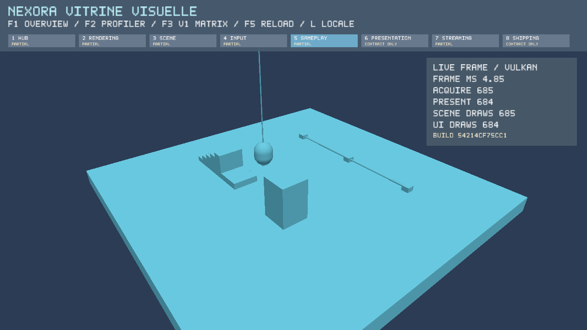
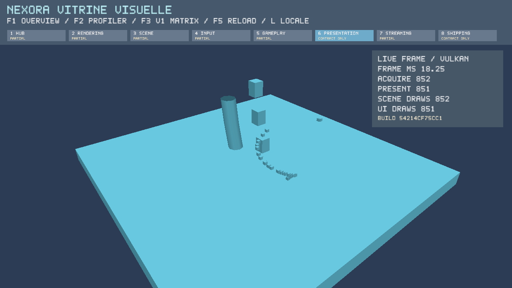
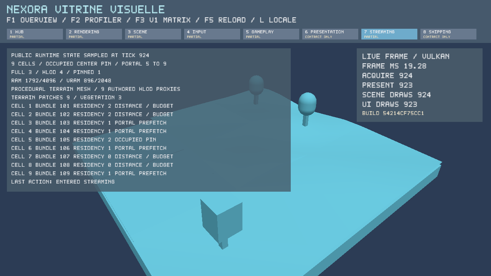
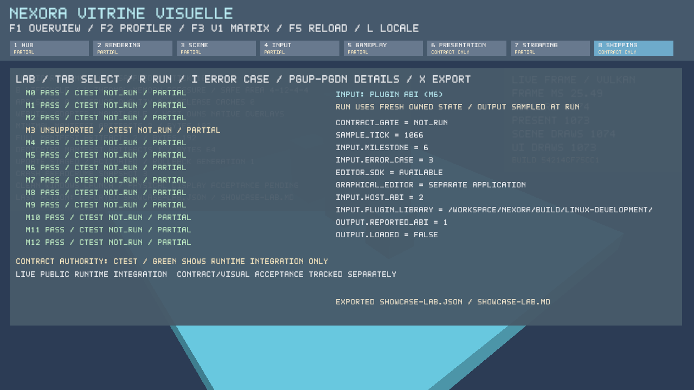

# Linux live Validation Lab and procedural geometry acceptance

Scope: Linux/X11/Vulkan under Xvfb and Mesa lavapipe, 2026-10-03 (Asia/Taipei).
This does not certify Windows, physical-display, native media adapters or complete V1.
The build ID denotes the pre-commit base; source-provenance.json identifies the exact tested
working-tree sources, including integration of main's Editor/runtime and native pixel gates.

- PASS: cmake --preset linux-development
- PASS: cmake --build --preset linux-development -j 4
- PASS: ctest --preset linux-development — 75/75, no skips. All five native gates execute
  with Khronos validation and synchronization validation enabled (see ctest.log).
- PASS: cmake --preset linux-shipping; cmake --build --preset linux-shipping -j 4
- PASS: cmake --preset linux-showcase-shipping; cmake --build --preset linux-showcase-shipping
  --target NexoraShowcasePackageShippingEvidence -j 4
- PASS: cmake --build --preset linux-development --target NexoraShowcasePackageDevelopmentEvidence -j 4

Local tool/dependency paths are configured in the Linux caches; no Windows preset was run.
Native environment: CI=true, VK_DRIVER_FILES=lavapipe ICD, VK_LAYER_PATH=Khronos layer directory,
VK_INSTANCE_LAYERS=VK_LAYER_KHRONOS_validation,
VK_LAYER_ENABLES=VK_VALIDATION_FEATURE_ENABLE_SYNCHRONIZATION_VALIDATION_EXT.

The live lab exposes input case, sample tick, outputs and issues, cycles error cases, scrolls
and exports reports. Real M5 empty import/dependency-cycle/rollback, M6 dynamic-library ABI
rejection before registration, and M12 update rollback use public Runtime APIs. Missing
libraries fail; unavailable feature/case combinations remain unsupported. Runtime integration
PASS still retains contract_gate=NOT_RUN; the CTest result is separate authority.

Gameplay renders a feet-origin capsule, collision-aligned AABB stair ramp, actual ray/path
geometry. Regressions cover 240 stationary ground ticks and a large downward step without
floor penetration. Presentation renders CPU weighted palette skin deformation, two-clip
blending and owning live particle positions. The particle contract checks snapshot independence,
velocity integration and expiration. Streaming renders original heightfield subdivision meshes,
coarse HLOD proxies and tree geometry according to public cell residency. RAM/VRAM values
are authored streaming estimates, not GPU allocation measurements.

interactive.json contains native frame/UI/scene/acquire/present evidence; lab-export.json/md
contain the exported sampled probe state. Development and Full package reports retain isolated
launch/checksum evidence. The optional ABI example plugin is included beside the executable.
