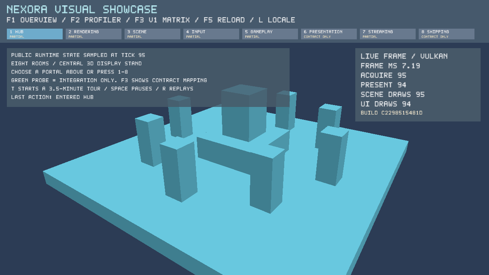
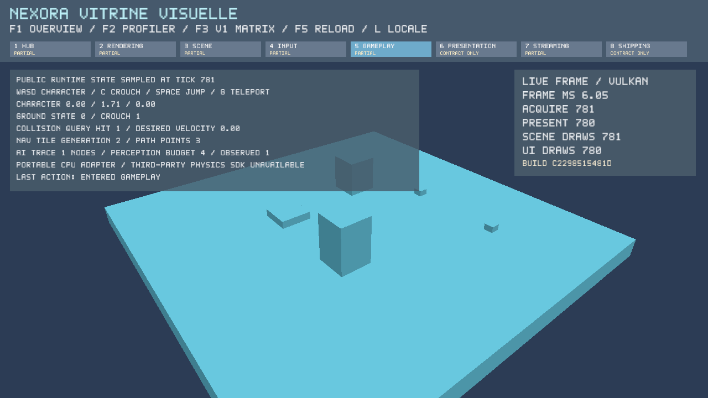

# Linux Vulkan V1 Visual Showcase evidence — 2026-10-03

This accepts the Linux virtual-display vertical slice only. It does not certify the full V1
showcase, an expanded Windows clean-machine launch, physical GPU/display acceptance or Metal.
The date uses Asia/Taipei; reports retain their actual UTC capture time. The embedded build ID is
the base revision; `source-provenance.json` hashes the working-tree sources that produced this evidence.

## Native acceptance

Xvfb 24-bit TrueColor, Mesa lavapipe and the Khronos validation layer executed real 3D/UI draws.
The test waits for nonblank pixels before capture, routes actual X11 keyboard/mouse events,
visits and renders all eight rooms, edits/undoes and isolates Play World, reloads a scene, switches
locale, moves/crouches/teleports the character, drags the camera, replays the tour and resizes.
It rejects validation errors and synchronization hazards. Screenshots are corroborating evidence;
JSON counters and executable assertions provide independent acceptance checks.

- Acquires/presents: **1505/1505**.
- Native scene/UI draws: **1505/1505**.
- Resize generations: **1**; no backend fallback or CPU composite.
- `triangle: false` is the retained legacy software-triangle indicator; genuine indexed geometry
  is evidenced by `scene_draws` and `rendering_mode: gpu_scene`.
- Nine live captures: Hub, Rendering, Scene, Input, Gameplay, Presentation, Streaming, Shipping,
  resized Hub. Audio/video playback and WebView are explicitly contract-only/unavailable.

## Validation

The session unpacked its compiler/build/X11 tools into `/workspace`, without changing host
system directories. CMake's development cache enabled `NEXORA_ENABLE_ZIG_GAMEPLAY=ON` and used
local dependency paths; no CMakeUserPresets or generated binaries are committed.

| Exact command | Result |
| --- | --- |
| `cmake --preset linux-development` | PASS |
| `cmake --build --preset linux-development -j 4` | PASS |
| `ctest --preset linux-development` | **72/72 PASS**, including both non-skipped native tests |
| `cmake --preset linux-shipping` | PASS — Minimal/Monolithic |
| `cmake --build --preset linux-shipping -j 4` | PASS |
| `cmake --preset linux-showcase-shipping` | PASS — Full/Monolithic |
| `cmake --build --preset linux-showcase-shipping --target NexoraShowcasePackageShippingEvidence -j 4` | PASS — checksums and isolated headless launch |
| `cmake --build --preset linux-development --target NexoraShowcasePackageDevelopmentEvidence -j 4` | PASS — all seven engine libraries resolve inside isolated package |
| `ctest --preset linux-development -R 'showcase.linux_vulkan_virtual_display|showcase.linux_vulkan_interaction'` | **2/2 PASS** with Khronos validation and synchronization validation |

Native commands inherited `PATH` for Xvfb/xdotool, `LD_LIBRARY_PATH` for local dependencies,
`VK_DRIVER_FILES` for lavapipe and `CI=true`. The focused validation run additionally set
`VK_LAYER_PATH`, `VK_INSTANCE_LAYERS=VK_LAYER_KHRONOS_validation` and
`VK_LAYER_ENABLES=VK_VALIDATION_FEATURE_ENABLE_SYNCHRONIZATION_VALIDATION_EXT`.
`NEXORA_SHOWCASE_EVIDENCE_DIR` retained these files. Full-tour timing/pause/replay is covered by
`showcase.runtime_rooms`; the native interaction test exercises controls without waiting 210 seconds.

## Remaining acceptance

Native textured materials/instancing and RenderGraph scene binding, richer capsule/ramp/skin/particle
content, full probe input/output/error controls and live plugin ABI rejection remain software work.
The expanded Full Windows application and workflow need Windows execution and clean graphical
host evidence; physical-display and other native-backend acceptance also remain open.

