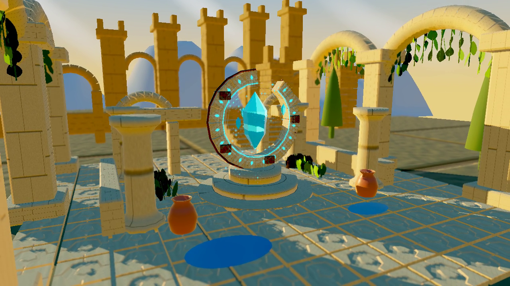

# Golden-hour background and HDR evidence

Actual Linux software Vulkan rendering of source `97b20cdeb1a6e6ea035d639d2752fc9daa8c4144`.
Linux Development configure/build/full CTest: 97/97 PASS, 53.10s, no skips. Shipping/Full and
Shipping/Minimal builds pass. The checksum-verified isolated Shipping copy launches and passes
native input/scene checks. All 45 native PBR pixel frames pass, including depth-aware focus and
sharp post-composite UI. Native focus/bloom/wind comparisons restore exactly; pause/replay,
quality cycle and free movement retain strict pixel assertions.

The same packaged executable produces the actual 100.266667-second video and all nine quality
measurements. It uses wall-clock courtyard animation at low frame rates; the prior 0.1-second
cap stretched a real tour to 166 seconds and failed the retained recorder budget. The corrected
recording passes the unchanged 90–120-second gate; it is not retimed. See
[Release provenance](release-provenance.json), [Native isolated acceptance](native-package/native-acceptance.json),
and [Full native movie](recording/visual-tour.mp4).

## Fixed-time native quality observations

Each tier has three sequential 360-frame runs: 60 warm-up frames excluded, 300 measured frames,
1280x720, vsync off, UI off, paused at time zero, device active. Own builds/tests/recording were
idle during the measurements. CPU is process CPU time across threads; it is not GPU timing.

| Tier / run | FPS | P95 ms | P99 ms | CPU ms/frame | Peak RSS MiB |
| --- | --- | --- | --- | --- | --- |
| basic / 1 | 11.94 | 96.79 | 108.66 | 295.37 | 174.26 |
| basic / 2 | 12.16 | 90.36 | 101.44 | 291.32 | 174.36 |
| basic / 3 | 11.97 | 101.10 | 118.69 | 291.51 | 174.30 |
| standard / 1 | 7.47 | 158.71 | 179.57 | 518.81 | 192.76 |
| standard / 2 | 7.31 | 160.12 | 178.94 | 531.37 | 193.20 |
| standard / 3 | 7.59 | 156.56 | 181.92 | 511.01 | 193.08 |
| high / 1 | 6.47 | 185.87 | 211.04 | 602.28 | 265.57 |
| high / 2 | 6.64 | 175.94 | 187.53 | 589.81 | 265.95 |
| high / 3 | 6.78 | 170.45 | 178.19 | 578.77 | 266.48 |

These are software-rasterizer regression observations, not a GTX 960 or physical DX12/Vulkan
budget acceptance. The expanded scene and focus filter add work; do not claim a performance
improvement from this data. Basic retains HDR color/transfer but disables IBL/bloom/focus;
Standard and High enable these and select their real geometry/shadow budgets.

## Scope and remaining reference work

This version adds six-face sky/cloud authoring, an HDR solar disc aligned with the low-angle
key light and IBL, original layered ruins/ridges/arcades/cypresses, rooted vine wind, fluted/
bevelled stone, 256x256 detail maps, glowing rune rails, rotating/hovering crystal and splinters,
particles, rippling PBR water and animated distant falls. HDR radiance survives through a
depth-aware focus and bloom composition before ACES/display transfer.

Reference art parity is not accepted: these procedural assets are not identical to
`Roadmap/art/V1-Visual-Identity-Concept.png`. Puddles currently use direct/IBL reflection, not
planar scene reflection/refraction; material/foliage detail remains in progress. The three newly
authored sandstone/height/ivy source images prepared separately are not part of this frozen
version. Keep the overall goal open; this is a tested incremental feature delivery. Physical
Windows target art/performance acceptance remains required. Earlier packages/hardware reports
do not accept this new scene. VIS-M3/M6 remain open, 5/7 accepted.
