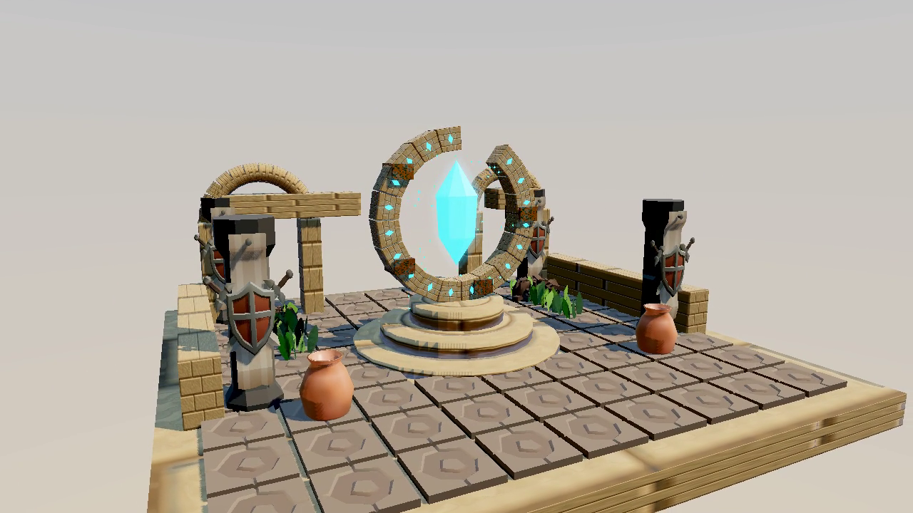

# VIS-M6 matching-version release evidence

Linux Development configure/build/full CTest: 97/97 PASS, 40.62s, no skips. Shipping/Full configure/build/package launch, checksum-verified isolated native interaction and 43 native PBR pixel cases pass. Quality changes High/Basic and returns to exactly identical Standard native pixels; pause, replay, free translation and feature comparisons are retained.

Production source commit `3047d5c68de939c6ead3bfceb8a47c5d6ccf3524` includes the latest Editor main integration and corrected packaged courtyard entry. The shared source/hash manifest, executable hash, ZIP hash, all nine performance reports and native video prove one Linux release version. Evidence/documentation commits after that code commit do not change the retained production source. The compiled ZIP is a workspace deliverable, not checked-in build output.

- [Performance and scope](Performance.md)
- [Release provenance](release-provenance.json)
- [Native isolated-copy acceptance](native-package/native-acceptance.json)
- [Full actual native tour](recording/visual-tour.mp4)
- [Recording metadata](recording/recording.json)

Physical Windows DX12/Vulkan hero/material art approval and confirmed target-performance budget remain open. Metal physical acceptance is explicitly deferred, not a gate for this delivery. Hosted/native CI execution remains separate from physical GPU evidence. See Target-Hardware.md for the concrete remaining verification.

PR #328 head `4c944fca96bee9863b652940cc41f00a408ae406` passed all 18 checks in Build 1471 (run 37292103114) and merged as `f016aa2a51b04475ae47657a6af042a0282b02ee`. The continuous recording, effect comparisons and native replay evidence accept VIS-M4/M5. VIS-M3/M6 physical target gates remain open: 5/7 accepted.
