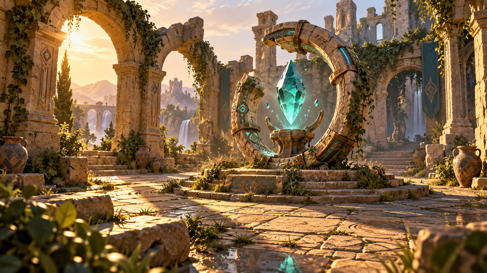

# Nexora V1 視覺特色 Showcase Roadmap

✅ 磨損地磚發布版本保留已合併的 Editor／Animation／Runtime 主分支整合。完整 Linux configure/build 與 109/109 測試通過（134.89 秒，core/sync 驗證），Full Monolithic Shipping configure/build 通過。凍結 Showcase Shipping 原生操作、風／反射／遮蔽精確還原與真正 100 秒動畫導覽通過（實際 100.88 秒）；三個固定原生鏡位的 PNG 與前一個地磚候選版本逐位元組一致。來源凍結 `da9243961d1352176349aa48f0ed22fd98924f50`；證據：`Apps/Showcase/evidence/VIS-Paving-Worn-Edges-Linux-2026-10-08/integration/`。參考圖一致性與實體目標驗收仍未完成（VIS 5/7）。

✅ 共享地磚原型的倒角由 0.035 加寬至 0.07 世界單位，確定性的缺角步距由 0.006 調至 0.018，讓磨損石縫接受原生光照與接觸遮蔽。乾／濕地磚維持原本位置、材質與數量。凍結的廣角／材質／動態鏡位比較只改變第 397／406／397 列以下的畫面，保留上方主體與背景像素。完整 Linux configure/build 與 106/106 測試通過（135.57 秒，core/sync 驗證）；凍結 Shipping 原生操作、風／反射／遮蔽精確還原及真正 100 秒導覽通過（實際 100.98 秒）。來源凍結 `dd6d1bb9cb278e4f1711a33f540750b7797f10d5`；證據：`Apps/Showcase/evidence/VIS-Paving-Worn-Edges-Linux-2026-10-08/`。參考圖一致性與實體目標驗收仍未完成（VIS 5/7）。

✅ 遠景瀑布加寬六條共享水帶，左側水流可從背景拱門看見。左側水流與支撐峭壁的 XZ 位置由 (-17,-19) 調至 (-11,-24)，高度由 6.2 降至 5.5；右側維持原本位置與高度。水帶半寬由 0.05 調至 0.075、間距由 0.17 調至 0.25，保留間隙與向下流動的共享動畫時鐘。完整 Linux configure/build 與 106/106 測試通過（136.14 秒，core/sync 驗證）；凍結 Shipping 原生操作、風／反射／接觸遮蔽精確還原與真正 100 秒動畫錄影通過（實際 101.31 秒）。來源凍結 `3dff93d9ba517e6d5e3787037c52f9227b8aaf81`；證據：`Apps/Showcase/evidence/VIS-Waterfall-Framing-Linux-2026-10-07/`。參考圖一致性與實體目標驗收仍未完成（VIS 5/7）。

✅ 固定接觸遮蔽核心改用條件包覆取樣與單一迴圈計數更新，避免原生 FXC X3511；六組 Vulkan 原生 fixture 圖像與前一版逐位元組一致。整合版本保留地標柏樹構圖、32 至 64 世界單位的遠距淡出及已合併 Animation 更新。完整 Linux configure/build 與 106/106 測試通過（137.36 秒，core/sync validation）；Full Monolithic Shipping configure/build 通過。凍結的 Showcase Shipping 原生驗收、風／反射／遮蔽精確還原及 100 秒動畫錄製通過（實際 101.15 秒）。來源凍結 `5d566aa94aa708b1329d807c9ffaa53575b7807e`；證據：`Apps/Showcase/evidence/VIS-Screen-Space-Occlusion-Linux-2026-10-07/loop-guards/`。Windows CI 通過後才合併；預覽圖一致性及實體目標硬體驗收仍未完成（VIS 5/7）。

✅ 螢幕空間接觸遮蔽在 32 至 64 世界單位之間逐漸停用，避免 RGBA16F 幾何距離精度下降時在遠方 skybox 產生假陰影。原生 fixtures 驗證啟用遮蔽時遠方幾何保持一致，並保留交接處變暗、平面穩定、HDR 高亮及精確還原驗證；這個凍結版本也包含地標柏樹構圖。完整 Linux configure/build 與 104/104 測試通過（133.38 秒，core/sync validation）；Shipping 原生驗收、風／反射／遮蔽精確還原及 100 秒動畫錄製通過（實際 100.98 秒）。來源凍結 `c8fd0ebc6b9fac467a7fa812bdc353c2c0e33a58`；證據：`Apps/Showcase/evidence/VIS-Screen-Space-Occlusion-Linux-2026-10-07/distance-fade/`。Windows CI 仍在驗證；預覽圖一致性及實體目標硬體驗收仍未完成（VIS 5/7）。

✅ 地標柏樹的 XZ 位置由 (-12.5,-9) 改為 (-14.2,-9)，使針葉樹冠出現在 wide 鏡頭的左側拱門開口；樹冠分層跨度由 5.22 增至 5.85 世界單位。樹幹與樹冠共用位置，其他樹木保留既有位置及高度，針葉遮罩、風、幾何數量、材質與光源保持一致。完整 Linux configure/build 與 104/104 測試通過（134.70 秒，core/sync validation）；Shipping 原生驗收、風／反射／遮蔽精確還原及 100 秒動畫錄製通過（實際 101.15 秒）。來源凍結 `748e841427cfe22c1d99407ac122dfce45c9b47a`；證據：`Apps/Showcase/evidence/VIS-Cypress-Aperture-Linux-2026-10-07/`。預覽圖一致性及實體目標硬體驗收仍未完成（VIS 5/7）。

✅ Standard／High 新增可關閉的螢幕空間接觸遮蔽，使用原生 HDR 幾何距離；Basic 不啟用，F11 切換。四個鄰近深度重建法線，十二個取樣依世界距離與 bias 排除無效遮蔽，各軸限制為 32 實體像素。共用 Slang tone pass 與複製的 80-byte packet 支援 Vulkan、DX12 與 Metal。原生 fixtures 驗證交接處變暗、平面穩定、HDR 高亮保持一致，以及停用／零強度精確還原；bloom 使用原始 HDR radiance，UI 在後處理後繪製。這是螢幕空間的合成近似，不宣稱隱藏／畫面外幾何或光線追蹤。包含已合併 Editor profiler 匯入更新的完整 Linux configure/build 與 104/104 測試通過（135.83 秒，core/sync validation）；Shipping 原生驗收、風／反射／遮蔽精確還原及 100 秒動畫錄製通過（實際 101.08 秒）。來源凍結 `60e6a54621fe3bcfedf4b6d5b3ccd8e5419b05b3`；證據：`Apps/Showcase/evidence/VIS-Screen-Space-Occlusion-Linux-2026-10-07/`。預覽圖一致性及實體目標硬體驗收仍未完成（VIS 5/7）。

✅ 庭院環體沿垂直軸旋轉 -0.35 弧度，石材、銅帶、符文與附著藤蔓維持貼合；位置、法線及切線一併旋轉。水晶與盆座保留原始錨點，幾何數量、材質、原生風及共用動畫時鐘保持一致。完整 Linux configure/build 與 104/104 測試通過（130.34 秒，core/sync validation）；Shipping 原生驗收、風／反射精確還原及 100 秒動畫錄製通過（實際 101.10 秒）。來源凍結 `bb20d2807e5cb83149875acf96163d15a348df82`；證據：`Apps/Showcase/evidence/VIS-Device-Ring-Yaw-Linux-2026-10-07/`。預覽圖一致性及實體目標硬體驗收仍未完成（VIS 5/7）。

✅ 柏樹樹冠改用原創針葉枝葉素材與獨立 cutout 材質，保留共用風、雙面受光、alpha 裁切及平面反射；來源 PNG 經雜湊驗證並可重現烘焙為根部對齊的 256 像素卡片。既有幾何／枝葉數量、常春藤、光源、shader packets 與 stable ABI 保持不變，Standard 使用 24 組原始與 24 組鏡面材質。Room contracts 驗證遮罩覆蓋、獨立紋理、柏樹反射及風切換精確還原。完整 Linux configure/build 與 104/104 測試通過（132.49 秒，core/sync validation）；Shipping 原生驗收、風／反射精確還原及 100 秒動畫錄製通過（實際 100.95 秒）。來源凍結 `56b2e509a376de5f5c40d644a2fb7ee8ae725d0e`；證據：`Apps/Showcase/evidence/VIS-Cypress-Crown-Linux-2026-10-07/`。Standard 使用 60,685 頂點、139,680 索引、393 batches、48 材質。預覽圖一致性及實體目標硬體驗收仍未完成（VIS 5/7）。

✅ 原生 HDR 太陽、主光／陰影方向、skybox 與浮點 IBL 同步使用作者設定方向 (-18, 5, -19.2)，左側藤蔓僅省略五組根部與葉片形成小開口，使日輪露出；其餘常春藤、原始圖片、太陽／主光 radiance、BRDF LUT 與動畫時鐘保持不變。此最終套件包含已另行驗證的前景植被配置與較柔和景深。完整 Linux configure/build 與 104/104 測試通過（128.43 秒，core/sync validation）；Shipping 原生驗收、風／反射精確還原及 100 秒動畫錄製通過（實際 101.16 秒）。來源凍結 `c25b4c460948c34c12bd28b3857f506c2b5127b0`；證據：`Apps/Showcase/evidence/VIS-Courtyard-Sun-Window-Linux-2026-10-07/`。Standard 使用 60,685 頂點、139,680 索引、393 batches、46 材質。預覽圖一致性及實體目標硬體驗收仍未完成（VIS 5/7）。

✅ 將 Standard／High 景深強度從 0.65／0.8 降低為 0.35／0.5，使焦點周圍的背景塔樓、瀑布與石材細節更清楚；焦距、幾何深度、取樣半徑、HDR bloom、光源與幾何保持不變。此套件也包含已另行驗證的前景植被配置。完整 Linux configure/build 與 104/104 測試通過（128.41 秒，core/sync validation）；Shipping 原生驗收、風／反射精確還原及 100 秒動畫錄製通過（實際 100.96 秒）。來源凍結 `37b40b8005942805507bfc5f57fc061afe7e8b75`；證據：`Apps/Showcase/evidence/VIS-Courtyard-Focus-Clarity-Linux-2026-10-07/`。Standard 使用 60,865 頂點、140,070 索引、393 batches、46 材質。預覽圖一致性及實體目標硬體驗收仍未完成（VIS 5/7）。

✅ 重新配置兩組既有前景植被，使寬景與近景的庭院入口邊緣都有清楚植被層次；原始 alpha 遮罩、枝葉數量、葉片形狀、材質與 GPU 風保持不變，未增加幾何量。完整 Linux configure/build 與 104/104 測試通過（128.50 秒，core/sync validation）；Shipping 原生驗收、風／反射精確還原及 100 秒動畫錄製通過（實際 101.15 秒）。來源凍結 `236bf29ef11091ed6a405b3ae5fb40252b426ff0`；證據：`Apps/Showcase/evidence/VIS-Foreground-Bank-Placement-Linux-2026-10-07/`。Standard 使用 60,865 頂點、140,070 索引、393 batches、46 材質。預覽圖一致性及實體目標硬體驗收仍未完成（VIS 5/7）。

✅ 將前景／背景石材與濕石鋪面的原始紋理尺度從每公尺 1.1 次調整為 0.4 次，使較大的侵蝕裂紋更清楚；原始圖片、烘焙紋理、粗糙度、法線強度、光源、幾何與動畫保持不變。完整 Linux configure/build 與 104/104 測試通過（125.60 秒，core/sync validation）；Shipping 原生驗收、風／反射精確還原及 100 秒動畫錄製通過（實際 101.14 秒）。來源凍結 `c80496cff0fd991093cbe48d43d4ebff8e93112c`；證據：`Apps/Showcase/evidence/VIS-Stone-Weathering-Scale-Linux-2026-10-07/`。Standard 使用 60,865 頂點、140,070 索引、393 batches、46 材質。預覽圖一致性及實體目標硬體驗收仍未完成（VIS 5/7）。

✅ 將切面水晶外殼與內部核心的 X/Z 寬度增加 50%，使輪廓更接近預覽圖；外殼法線同步使用 inverse-transpose 縮放，高度、懸浮間距、折射、發光與共用動畫時鐘保持不變。完整 Linux configure/build 與 104/104 測試通過（126.28 秒，core/sync validation）；Shipping 原生驗收、風／反射精確還原及 100 秒動畫錄製通過（實際 101.14 秒）。來源凍結 `62da0c38f9e82cd797fba8ae5dd62d28eac803a9`；證據：`Apps/Showcase/evidence/VIS-Crystal-Silhouette-Linux-2026-10-07/`。Standard 使用 60,865 頂點、140,070 索引、393 batches、46 材質。預覽圖一致性及實體目標硬體驗收仍未完成（VIS 5/7）。

✅ 太陽仰角版本整合已接受主線 `deab1c965704`，保留全部 18 個 PoseSearch／建置／文件路徑，Showcase 自有來源逐位元組一致。完整 Linux configure/build 與 104/104 測試通過（123.68 秒，core/sync validation），一般 linux-shipping Full／Monolithic 建置亦通過。凍結 `5ee0a10628bc` 的 Shipping 執行檔完成原生驗收、風／反射精確還原及 100 秒動畫錄製（實際 101.22 秒）。原始 `be4fb04` 證據保持不變；同版本整合證據：`Apps/Showcase/evidence/VIS-Solar-Elevation-Linux-2026-10-07/main-integration/`。VIS 維持 5/7；預覽圖一致性及實體目標硬體驗收仍待完成。

✅ 提高黃昏太陽仰角，同步原生 HDR 太陽、主光、skybox 與重新烘焙的浮點 IBL，使前景受光與陰影更清楚；原始圖片、radiance 因子與動畫時鐘保持不變。完整 Linux configure/build 與 102/102 測試通過（123.38 秒，core/sync validation）；Shipping 原生驗收、風／反射精確還原及 100 秒動畫錄製通過（實際 101.15 秒）。來源凍結 `be4fb04edf382692c5a5903f571c2afad5ae20a1`；證據：`Apps/Showcase/evidence/VIS-Solar-Elevation-Linux-2026-10-07/`。Standard 使用 60,865 頂點、140,070 索引、393 batches、46 材質。HDR、skybox 與共用時鐘動畫保持運作；預覽圖一致性及實體目標硬體驗收仍未完成（VIS 5/7）。

✅ 花器旁灌木改用較小的分層橄欖葉片與細木莖；提高葉片反射色，保留原始貼圖且不增加自發光。完整 Linux configure/build 與 102/102 測試通過（123.25 秒，core/sync validation）；Shipping 原生驗收、風／反射精確還原及 100 秒動畫錄製通過（實際 101.37 秒）。來源凍結 `d95b337dd41ffe42f736bc3bb91428f0f211cd1d`；證據：`Apps/Showcase/evidence/VIS-Layered-Shrubs-Linux-2026-10-07/`。Standard 使用 60,865 頂點、140,070 索引、393 batches、46 材質。HDR、skybox 與共用時鐘動畫保持運作；預覽圖一致性及實體目標硬體驗收仍未完成（VIS 5/7）。

✅ 原創水晶石盆上部輪廓與放射支肋提高 0.15 世界單位，盆腳與平面範圍維持一致。實際共同時鐘的升降最低點幾何測試確認水晶仍高於盆口。Linux 完整 configure/build 與 102/102 測試通過（122.48 秒，core/sync validation）；Shipping 隔離原生驗收、風／反射精確還原與實際 100 秒動畫影片通過（壁鐘 101.23 秒）。凍結版本 `586d14295ad3b70a44e2a59083f8f398fe86ef33`；證據：`Apps/Showcase/evidence/VIS-Crystal-Basin-Linux-2026-10-07/`。Standard 維持 60,097 vertices、138,150 indices、389 batches、46 materials；HDR、skybox、風與動畫持續運作。預覽圖一致性與實體 GPU／顯示器驗收仍未完成（VIS 5/7）。

✅ 原生草葉整合保留已接受主線 `27bc395f6bb3`，包括 Editor journal／復原更新。Linux 完整 configure/build 與 102/102 測試通過（126.02 秒，core/sync validation）。Showcase 原始碼與留存的 `c17e9cf` Shipping／100 秒影片凍結版本逐 byte 相同；原始證據完整保留。最新整合日誌：`Apps/Showcase/evidence/VIS-Native-Grass-Integration-Linux-2026-10-07/main-integration/`。VIS 維持 5/7；最終預覽圖一致性與實體 GPU／顯示器驗收仍未完成。

✅ 原創細草生長於庭院鋪面間，保留根部固定的 GPU 風動、雙面 PBR、薄片透光、原生陰影與平面反射。水晶核心依高度分組；克制符文輻射與霧面青銅保留水晶 HDR bloom 和共同動畫時鐘。最新主線的原生裝置來源與品質量測功能完整保留。Linux 完整 configure/build 與 101/101 測試通過（119.84 秒，core/sync validation）；Shipping 隔離原生驗收、風／反射精確還原與實際 100 秒動畫影片通過（壁鐘 101.15 秒）。凍結版本 `c17e9cfb5a1365fbca8f43fce12941bca61f3206`；證據：`Apps/Showcase/evidence/VIS-Native-Grass-Integration-Linux-2026-10-07/`。Standard：60,097 vertices、138,150 indices、389 batches、46 materials、3,534 張來源植被 quad。預覽圖一致性與實體 GPU／顯示器驗收仍未完成，VIS 維持 5/7。

✅ 符文 emission（0.012、0.32、0.4）與 roughness 0.22 保留青色細節並收斂亮度；青銅反射係數（0.8、0.65、0.4）與 roughness 0.4 呈現較霧面的磨損飾帶與鉚釘。Linux 完整 97/97 測試通過（123.56 秒，core/sync validation），Shipping 隔離原生驗收與 100 秒共同時鐘影片通過（壁鐘 100.91 秒）。凍結版本 `5a7c665266fe34d18ad33dc1804a41f600786e68`；證據：`Apps/Showcase/evidence/VIS-Restrained-Runes-Linux-2026-10-06/`。Standard 維持 58,249 vertices、135,378 indices、387 batches、44 materials；貼圖／幾何、水晶 HDR 與共同脈動保持一致。VIS 仍為 5/7。

✅ 水晶內部礦物面依原始高度分層：下方 16 個明亮 HDR 三角形、中間 16 個與上方 16 個暗色三角形。位置、法線、UV、輻射亮度常數與動畫不變。Linux 完整 97/97 測試通過（121.63 秒，core/sync validation），Shipping 隔離原生驗收與 100 秒共同時鐘影片通過（壁鐘 100.91 秒）。凍結版本 `5f9104f71677df263f45078e0b894a8e045170ad`；證據：`Apps/Showcase/evidence/VIS-Crystal-Core-Gradient-Linux-2026-10-06/`。Standard 維持 58,249 vertices、135,378 indices、387 batches、44 materials；VIS 仍為 5/7。

✅ 已交付原生裝置來源記錄：Vulkan／DX12 報告保留實際選中的裝置名稱、vendor／device ID 與觀測到的原始驅動版本；Metal 保留所選裝置名稱，ID／驅動明確維持不可用。十進位字串避免 DXGI 64-bit 精度遺失。品質 benchmark 在 JSON／Markdown 保留識別並拒絕不同的觀測裝置／驅動；舊報告明確維持未識別。7 個證據政策測試於一般與最佳化 Python 通過。Build 1778（來源 `46eac3a50f83`）18 個工作全過，Linux 145/145、Windows 128/128、macOS 127/127，並通過原生 Shipping gate 與三品質量測，保留實際 llvmpipe／驅動觀測。GPU timestamp 與螢幕更新率仍不可用；VIS 維持 5/7，實體 GPU 預算與最終美術驗收保持開放。 [驗證證據](../../Apps/Showcase/evidence/VIS-M6-Native-Device-Provenance-CI-2026-10-07/acceptance.md).

✅ VIS-M6 量測工具：共用原生 DX12／Vulkan Shipping benchmark 依序量測 Basic／Standard／High，保留版本、執行檔／報告 SHA-256、原始日誌及 JSON／Markdown。每種品質預設三次獨立 360-frame 程序，捨棄 60-frame 暖機並量測 300 個樣本，使用時間零、啟動裝置的固定廣角。證據檢查拒絕 fallback／VSync 限速、不完整或過期報告、無效指標、混版及同品質場景漂移，Python 最佳化模式亦有效。五組政策測試已在兩種模式通過；Build 1755（來源 `2bfdee501726`）通過 Linux 143/143、Windows 126/126、macOS 125/125、原生 Shipping 驗收與九次完整 Linux 量測。[證據](../../Apps/Showcase/evidence/VIS-M6-Quality-Benchmark-CI-2026-10-07/acceptance.md)。一般分支 CI 改用三次 160-frame smoke；tag 與直接執行保留每種品質三次 360-frame 完整量測。GPU timestamps、driver／refresh 未觀測時保持缺值。此項補強 VIS-M6 交付，尚未驗收實體硬體效能或 VIS-M3 美術；進度維持 5/7。

✅ 可見 HDR 太陽與主光方向改為（-18、4、-19.2），與天空方位一致；左側拱廊及附著藤葉向外移動，解除石柱遮擋。浮點 diffuse／specular IBL 重新烘焙，BRDF LUT 與原始圖片不變。Linux 完整 97/97 測試通過（121.07 秒，core/sync validation），Shipping 隔離原生驗收與 100 秒共同時鐘影片通過（壁鐘 101.23 秒）。凍結版本 `899958d93d53819bc169a1c04520e77b43a8774f`；證據：`Apps/Showcase/evidence/VIS-Sunset-Alignment-Linux-2026-10-06/`。Standard 維持 58,249 vertices、135,378 indices、387 batches、44 materials；VIS 仍為 5/7。

✅ 九塊原創倒塌砂岩以三個共用風化模型形成庭院前景，中央裝置與水窪視線保持開放。Linux 完整 97/97 測試通過（120.57 秒，core/sync validation），Shipping 隔離原生驗收與 100 秒共同時鐘影片通過（壁鐘 100.99 秒）。凍結版本 `d484e7e2d75cfaab539e020d30cdf3c2bbecdecd`；證據：`Apps/Showcase/evidence/VIS-Foreground-Rubble-Linux-2026-10-06/`。Standard 為 58,249 vertices、135,378 indices、387 batches、44 materials。HDR、天空、風、貼圖與時鐘維持一致；VIS 仍為 5/7。

✅ 原創單片常春藤葉取代整株卡片，懸掛、攀附與前景卡片縮小，保留風動畫與附著根部。Linux 完整 97/97 測試通過（118.92 秒，core/sync validation），Shipping 隔離原生驗收與 100 秒共同時鐘影片通過（壁鐘 101.04 秒）。凍結版本 `61235ecdef9adb8ab57215afd0a9f27df861726c`；證據：`Apps/Showcase/evidence/VIS-Single-Leaf-Linux-2026-10-06/`。Standard 維持 57,961 vertices、134,982 indices、384 batches、44 materials；原始整株葉圖與天空／HDR 資料留存。VIS 仍為 5/7。

✅ Skybox 六個面提升為 256×256（768×512 RGBA8 atlas），保留雲層細節。原始天空圖與浮點 HDR IBL 資料保持一致，原生 HDR 日光、bloom 與共同時鐘動畫持續運作。Linux 完整 97/97 測試通過（122.80 秒，core/sync validation），Shipping 隔離原生驗收與 100 秒影片通過（壁鐘 101.06 秒）。凍結版本 `2b2be9d670c9c691e2f333ce0efa2821c9539f78`；證據：`Apps/Showcase/evidence/VIS-Detailed-Sky-Linux-2026-10-06/`。幾何維持 57,961 vertices、134,982 indices、384 batches、44 materials。VIS 仍為 5/7。

✅ 庭院葉片使用橄欖色反射係數（0.42、0.52、0.30），保留環境光、texture alpha、雙面光照、風與暖色透光。Linux 完整 97/97 測試通過（119.89 秒，core/sync validation），Shipping 隔離原生驗收與 100 秒共同時鐘影片通過（壁鐘 100.93 秒）。凍結版本 `db4d3f38de133ec6a22e4d142cac7ea6e100ac5b`；證據：`Apps/Showcase/evidence/VIS-Olive-Foliage-Linux-2026-10-06/`。幾何維持 57,961 vertices、134,982 indices、384 batches、44 materials。VIS 仍為 5/7。

✅ 遠景塔樓的狹長上層開口已有厚石窗邊、共用前後拱石與頂部過梁；交錯山脊摺面增加斜向岩面。Linux 完整 97/97 測試通過（120.62 秒，core/sync validation），Shipping 隔離原生驗收與 100 秒共同時鐘影片通過（壁鐘 101.04 秒）。凍結版本 `94b7f09807e4dae93b931776d530bc51a855dc56`；證據：`Apps/Showcase/evidence/VIS-Tower-Ridges-Linux-2026-10-06/`。Standard：57,961 vertices、134,982 indices、384 batches、44 materials。VIS 仍為 5/7。

✅ 六根廊柱的十二個菱形邊框已填入既有 material 3 的陶瓷鑲片。Linux 完整 97/97 測試通過（119.52 秒，core/sync validation），Shipping 隔離原生驗收與 100 秒共同時鐘影片通過（壁鐘 101.22 秒）。製作凍結版本 `2c7d68a0c8bfe4393f8051e4c94356e34b93cd46`；證據：`Apps/Showcase/evidence/VIS-Arcade-Inlays-Linux-2026-10-06/`。Standard：56,713 vertices、133,266 indices、371 batches、44 materials。VIS 仍為 5/7。

✅ F4 乾淨畫面驗證會等待實際導覽列消失。保留的 CI 失敗重播、Linux 完整 97/97 gate（118.49 秒，core/sync validation）與隔離 Shipping bloom 變化／精確還原驗證均通過。證據：`Tests/Showcase/evidence/Native-Clean-Frame-Linux-2026-10-06/`。比較等待上限保持一致；VIS 仍為 5/7。

✅ Linux Development 完整 97/97 測試通過（117.48 秒，Khronos core/sync validation），包含 99 個原生 PBR frames。Shipping/Full 隔離原生驗收與實際 100 秒共同時鐘影片通過（壁鐘 100.82 秒）。製作凍結版本 `d04ef3db67707511b62e64385151dbf6af22ef3b`；證據：`Apps/Showcase/evidence/VIS-Planar-Receiver-Linux-2026-10-06/`。VIS 仍為 5/7；預覽圖一致性與實體顯示器驗收仍未完成。

平面水面保留真實石材底色：原生 adapters 先繪製獨立 HDR 鏡像，再依 Fresnel 混合反射與地板輻射。前景深度會遮住水面，景深仍使用地板距離；鏡像與主畫面的玻璃依序使用各自 opaque snapshot。六個原生反射 fixtures 驗證底色、移動、遮擋與精確還原。新增每個 frame 擁有的 HDR color target；private shader packet 大小與穩定 ABI 保持一致。

✅ Linux Development 完整 97/97 測試通過（113.49 秒，Khronos core/sync validation）。Shipping/Full 隔離原生驗收與實際 100 秒共同時鐘影片通過（壁鐘 101.05 秒）。製作凍結版本 `ee8837eb3d55db9f0892f468ab70773cbc968809`；證據：`Apps/Showcase/evidence/VIS-Background-Shadows-Linux-2026-10-06/`。VIS 仍為 5/7；預覽圖一致性與實體顯示器驗收仍未完成。

背景陰影：Standard／High 啟用背景石造建築與木質莖幹的真實投影，山脊仍排除。48×30 世界單位的光源視錐與 80 單位遠平面納入遠塔頂部，兩種品質皆維持原生 2048 上限；Basic 保留前景視錐、512 陰影圖與背景排除。Standard 在兩倍水平範圍保持原有 texel 尺度，High 共用擴大範圍。左側廢墟移至 (-24,-26)，保留夕陽通道。測試確認品質投影資格、塔頂覆蓋與 CLI 精確品質契約。Shader 封包、穩定 ABI 與烘焙資產保持一致。

✅ Linux Development 完整 97/97 測試通過（110.68 秒，Khronos core/sync validation）。Shipping/Full 隔離原生驗收與實際 100 秒共同時鐘影片通過（壁鐘 100.74 秒）。製作凍結版本 `972ceb59e264c4ad132cb9d98125f4e4dc86e1d2`；證據：`Apps/Showcase/evidence/VIS-Refined-Sandstone-Linux-2026-10-06/`。VIS 仍為 5/7；預覽圖一致性與實體顯示器驗收仍未完成。

砂岩材質：新製作的 albedo／height 來源降低密集深色斑點，舊 sandstone PNG 保留且未修改。可重現 cook 更新 stone color／normal／ORM；前景基色係數為 0.8／0.8／0.8，背景為 0.7／0.68／0.62。IBL 來源雜湊中繼資料已重生，三份 IBL 二進位貼圖雜湊保持一致。首輪完整測試拒絕過期中繼資料，修正後完整 97/97 通過。引擎太陽、天空、HDR、風、shader 與穩定 ABI 保持一致。

✅ Linux Development 完整 97/97 測試通過（115.01 秒，Khronos core/sync validation）。Shipping/Full 隔離原生驗收與實際 100 秒共同時鐘影片通過（壁鐘 100.82 秒）。製作凍結版本 `b6814267f3bb43fca17e3cde0e65fa7b7c6a7082`；證據：`Apps/Showcase/evidence/VIS-Curved-Foliage-Linux-2026-10-06/`。VIS 仍為 5/7；預覽圖一致性與實體顯示器驗收仍未完成。

葉片幾何：有界折曲與確定性傾角增加葉片的立體變化，並提供符合表面的解析法線與切線。原始 UV、鏤空貼圖、頂點／索引數與共同時鐘風動畫保持一致；細小粒子仍為平面。測試確認葉片不共平面、法線與切線為單位向量且正交、面朝向正確。放大石材尺度的試作已於完整驗收前移除。Standard：56,665 頂點、133,194 索引、336 batches、44 材質。

✅ Linux Development 完整 97/97 測試通過（109.78 秒，Khronos core/sync validation）。Shipping/Full 隔離原生驗收與實際 100 秒共同時鐘影片通過（壁鐘 100.76 秒）。製作凍結版本 `b88e22c7b24aa6f63b697783c0c9d64b241b135a`；證據：`Apps/Showcase/evidence/VIS-Weathered-Blocks-Linux-2026-10-06/`。VIS 仍為 5/7；預覽圖一致性與實體顯示器驗收仍未完成。

石塊磨損：以有界、確定性的偏移變形倒角石塊與盒狀裝置細節的共用實體角點，並重算幾何面法線。測試確認 24 個實體角點、66 條邊皆由兩個三角面共用，沒有塌縮三角形且法線向外。原本每塊 96 頂點／132 索引、shader、穩定 ABI 與原始美術資產保持一致。Standard：56,665 頂點、133,194 索引、336 batches、44 材質。

✅ Linux Development 完整 97/97 測試通過（111.23 秒，Khronos core/sync validation）。Shipping/Full 隔離原生驗收與實際 100 秒共同時鐘影片通過（壁鐘 100.96 秒）。製作凍結版本 `029a500a781711b09c78ad4f4df8be93083c63c0`；證據：`Apps/Showcase/evidence/VIS-Wet-Paving-Linux-2026-10-06/`。VIS 仍為 5/7；預覽圖一致性與實體顯示器驗收仍未完成。

水窪邊緣鋪面迭代：兩處既有水窪附近的部分石塊使用新增非金屬濕石材質（底色 0.507／0.507／0.507、粗糙度 0.25、AO 0.55）。乾濕批次共用原有地磚頂點，各有連續索引範圍；432 個唯一變換完整保留。材質由 21 擴為 22 個原稿槽（含平面倒影共 44）。濕鋪面作為接收面並排除遞迴倒影；礦物例外限於 18–20 槽。測試保留乾磚實例化檢查，驗證濕石距離／粗糙度／零金屬度，並由實際材質數推導倒影粒子編號，檢查啟用與停用狀態。Standard 使用 56,665 頂點、133,194 索引與 336 批次。Linux configure/build 與完整 97/97 測試通過（111.23 秒，Khronos core/sync validation）。Shipping 隔離原生驗收與共同時鐘錄影通過；預覽圖一致性與實體顯示器驗收仍未完成（VIS 5/7）。

✅ Linux Development 完整 97/97 測試通過（116.67 秒，Khronos core/sync validation）。Shipping/Full 隔離原生驗收與實際 100 秒共同時鐘影片通過（壁鐘 101.06 秒）。製作凍結版本 `cbf8d651248ad28f8c077d10336366f460e308d2`；證據：`Apps/Showcase/evidence/VIS-Crystal-Radiance-Linux-2026-10-06/`。VIS 仍為 5/7；預覽圖一致性與實體顯示器驗收仍未完成。

水晶 HDR 輻射與柏樹迭代：降低符文光軌底色與發光，最亮的包覆礦物刻面在 bloom／ACES 之前達到線性輻射 1.8／1.35。局部點光改為 0.2／3／4，保留相同共同時鐘脈動、位置與半徑。左側柏樹移入目前廣角拱門開口；八支原創漸縮共用輪廓樹幹與木質藤莖採用既有細節貼圖。遠景投影資格、葉片／固定根部風動、折射封包與 cooked 原稿不變。Standard 使用 56,665 頂點、132,870 索引、330 批次與 42 材質。Linux configure/build 與完整 97/97 測試通過（116.67 秒，Khronos core/sync validation）。Shipping 隔離原生驗收與共同時鐘錄影通過；預覽圖一致性與實體顯示器驗收仍未完成（VIS 5/7）。

✅ Linux Development 完整 97/97 測試通過（113.60 秒，Khronos core/sync validation）。Shipping/Full 隔離原生驗收與實際 100 秒共同時鐘影片通過（壁鐘 100.70 秒）。製作凍結版本 `2d4989e49d5109ddb8f7b7d073a7b20ac718321b`；證據：`Apps/Showcase/evidence/VIS-Ruin-Masonry-Linux-2026-10-06/`。VIS 仍為 5/7；預覽圖一致性與實體顯示器驗收仍未完成。

背景石造迭代：九座遠景拱門使用 24 個共用原創倒角楔形石塊，以實際石縫取代管段。正向 X／Y 彎曲包含隨半徑調整的法線轉換，保留原有四座側拱廊彎曲。五座遠塔的上方四層改用四角支柱，下方雕刻在實際開口之前結束。Standard 使用 55,473 頂點、127,014 索引、330 批次與 42 材質。Linux configure/build 與完整 97/97 測試通過（113.60 秒，Khronos core/sync validation），包含實際楔形面朝向與各品質幾何預算。Shipping 隔離原生驗收與共同時鐘錄影通過；預覽圖一致性與實體顯示器驗收仍未完成（VIS 5/7）。

✅ Linux Development 完整 97/97 測試通過（111.59 秒，Khronos core/sync validation）。Shipping/Full 隔離原生驗收與實際 100 秒共同時鐘影片通過（壁鐘 100.92 秒）。製作凍結版本 `f105c7877a2bedc694643aab945345ce8cdcbc3d`；證據：`Apps/Showcase/evidence/VIS-Floor-Medallions-Linux-2026-10-06/`。VIS 仍為 5/7；預覽圖一致性與實體顯示器驗收仍未完成。

庭院鋪面與陶器迭代：兩處原創淺同心石雕使用實際原生幾何、光照與陰影。旋轉曲面共用輪廓列頂點並保留 UV 接縫，釋出 8,502 個重複頂點；實際石材／陶器／彩繪三角面檢查朝向、相鄰單位輪廓法線與凹槽角度斜率。新的平滑法線也影響 UV 選擇與衍生切線。既有陶器材質 3 採磨損冷色係數（0.24／0.36／0.43）、粗糙度 0.78 與原有石材貼圖，保留暖色彩繪和 42 材質。Standard 使用 54,609 頂點、128,946 索引與 301 批次。Linux configure/build 與完整 97/97 測試通過（111.59 秒，Khronos core/sync validation）。Shipping 隔離原生驗收與共同時鐘錄影通過；預覽圖一致性與實體顯示器驗收仍未完成（VIS 5/7）。

✅ Linux Development 完整 97/97 測試通過（111.27 秒，Khronos core/sync validation）。Shipping/Full 隔離原生驗收與實際 100 秒共同時鐘影片通過（壁鐘 101.21 秒）。製作凍結版本 `5cf914eda65f35faeb3cf937f55c049d296b1ccc`；證據：`Apps/Showcase/evidence/VIS-Waterfall-Ribbons-Linux-2026-10-06/`。VIS 仍為 5/7；預覽圖一致性與實體顯示器驗收仍未完成。

瀑布美術迭代：每處六條共用列頂點的細水束，保留實際間隙、不規則輪廓、向下流動波紋與解析法線。三角形朝向已修正，並以實際面法線檢查；降低材質輻射並採用 0.78 不透明度，露出後方岩壁。Standard 使用 61,679 頂點、122,994 索引與 42 材質。Linux configure/build 與完整 97/97 測試通過（111.27 秒，Khronos core/sync validation）。共同時鐘暫停／重播、shader、cooked 素材與穩定 ABI 不變。Shipping 隔離原生驗收與共同時鐘錄影通過；預覽圖一致性與實體顯示器驗收仍未完成（VIS 5/7）。

✅ Linux Development 完整 97/97 測試通過（110.65 秒，Khronos core/sync validation）。Shipping/Full 隔離原生驗收與實際 100 秒共同時鐘影片通過（壁鐘 100.78 秒）。製作凍結版本 `47675e7db75b669398368c902928c52866820a28`；證據：`Apps/Showcase/evidence/VIS-Camera-Framing-Linux-2026-10-06/`。VIS 仍為 5/7；預覽圖一致性與實體顯示器驗收仍未完成。

庭院構圖迭代：廣角預設由半徑 8／pitch 0.20 改為半徑 9／pitch 0.30，其餘預設略微提高，並同步導覽起點與終點構圖。原生鋪面、階梯與水窪更清楚；維持絕對軌道相機與可重播控制。Linux configure/build 與完整 97/97 測試通過（110.65 秒，Khronos core/sync validation），包含 MSVC 命名修正。Shipping 隔離原生驗收與共同時鐘錄影通過；預覽圖一致性與實體顯示器驗收仍未完成（VIS 5/7）。

Windows CI 命名修正：鉚釘迴圈區域變數改為 `rivetRadius`，修正 MSVC C4458；數值與運算不變。原生影片與套件證據凍結於改名前；合併仍須目前 head 的完整跨平台 CI 通過。

✅ Linux Development 完整 97/97 測試通過（110.96 秒，Khronos core/sync validation）。Shipping/Full 隔離原生驗收與實際 100 秒共同時鐘影片通過（壁鐘 100.76 秒）。製作凍結版本 `22df5bbb911907aa8bcd495e6da99532d75b9d79`；證據：`Apps/Showcase/evidence/VIS-Canopy-Puddles-Linux-2026-10-06/`。VIS 仍為 5/7；預覽圖一致性與實體顯示器驗收仍未完成。

植被與水窪迭代：增加原創拱廊與裝置藤蔓、六根立柱攀藤、分層柏樹與前景植被，保留根部固定的共同時鐘風動。重新構圖的水窪同時遮罩直視天空與地板，讓鏡射天空接受 Fresnel 衰減，修正未反射亮底色的深度遮擋。Standard 仍在 16-bit 幾何預算內（61,655 頂點、121,842 索引、42 材質、3,072 葉片卡）。Linux Development 設定、建置與完整 97/97 測試通過（110.96 秒，Khronos core/sync validation）。Shipping 隔離原生驗收與共同時鐘錄影通過；預覽圖一致性與實體顯示器驗收仍未完成（VIS 5/7）。

✅ Linux Development 完整 97/97 測試通過（111.61 秒，Khronos core/sync validation）。Shipping/Full 隔離原生驗收與實際 100 秒共同時鐘影片通過（壁鐘 100.69 秒）。製作凍結版本 `79540805777114ab26d77dadda2258db39d43046`；證據：`Apps/Showcase/evidence/VIS-Device-Inlays-Linux-2026-10-06/`。VIS 仍為 5/7；預覽圖一致性與實體顯示器驗收仍未完成。

主裝置細節持續修整：原創銅製圓頂鉚釘、符文鑲框、正確的環形石塊三角形繞序，以及包在外殼內的不規則礦物切面與實際幾何法線；玻璃較清透，陶器採暖色紋飾。原 cooked 資產、shader packet、穩定 ABI 與共同時鐘動畫不變。Linux configure/build 與完整 97/97 測試通過（111.61 秒，Khronos core/sync validation）；Shipping 驗證通過。VIS 仍為 5/7；預覽圖一致性與實體顯示器驗收仍未完成。

✅ Linux Development 完整 97/97 測試通過（112.34 秒，Khronos core/sync validation）。Shipping/Full 隔離原生驗收與實際 100 秒共同時鐘影片通過（壁鐘 100.84 秒）。製作凍結版本 `d5676eea058ecb999979120119f2ac36c6d5bad9`；證據：`Apps/Showcase/evidence/VIS-Background-Depth-Linux-2026-10-06/`。VIS 仍為 5/7；預覽圖一致性與實體顯示器驗收仍未完成。

背景場景持續修整：塔樓上層具有真正開口，共用頂點的連續山脊網格釋出 6,791 個頂點，並調整石材與遠景霧氣的層次。材質 AO 仍是統一控制，沒有新增空間接觸陰影。共同時鐘動畫、HDR 特色、紋理 ID 與原生 shader 契約不變；已整合並保留 main 的 Editor 變更。Linux configure/build 與完整 97/97 測試通過（112.34 秒，Khronos core/sync validation）；Shipping 驗證通過。VIS 仍為 5/7；預覽圖一致性與實體顯示器驗收仍未完成。

✅ Linux Development 完整 97/97 測試通過（110.56 秒，Khronos core/sync validation）。Shipping/Full 隔離原生驗收與實際 100 秒共同時鐘影片通過（壁鐘 100.73 秒）。製作凍結版本 `5615a2d816db60f099792eb8abe2ba09585427c3`；證據：`Apps/Showcase/evidence/VIS-Arcade-Stones-Linux-2026-10-06/`。VIS 仍為 5/7；預覽圖一致性與實體顯示器驗收仍未完成。

拱廊幾何持續修整：四座側拱共用 20 個原創倒角楔形石塊，具有真實接縫；柱面浮雕也朝向庭院。曲面轉換維持正向三角形繞序與正確法線。Linux configure/build 與完整 97/97 測試通過（110.56 秒，Khronos core/sync validation）；Shipping 驗證通過。VIS 仍為 5/7；預覽圖一致性與實體顯示器驗收仍未完成。

✅ Linux Development 完整 97/97 測試通過（110.29 秒，Khronos core/sync validation）。Shipping/Full 隔離原生驗收與實際 100 秒共同時鐘影片通過（壁鐘 100.81 秒）。製作凍結版本 `040a3acf7c07351b98b13f2e0c5c89e4d1d3584b`；證據：`Apps/Showcase/evidence/VIS-Crystal-Proportions-Linux-2026-10-06/`。VIS 仍為 5/7；預覽圖一致性與實體顯示器驗收仍未完成。

水晶呈現比例與石材環境光反應正在對照參考圖驗證：縮窄外殼與內部核心、轉換法線，並對齊光源與景深焦點。以既有材質統一 occlusion 控制調整石材，比較選單補上 F10 抗鋸齒。原 cooked 資產與原生 shader 契約不變。Linux configure/build 與完整 97/97 測試通過（110.29 秒，Khronos core/sync validation）；Shipping 驗證通過。VIS 仍為 5/7；預覽圖一致性與實體顯示器驗收仍未完成。

✅ Linux Development 完整 97/97 測試通過（109.50 秒，Khronos core/sync validation）。Shipping/Full 隔離原生驗收與實際 100 秒共同時鐘影片通過（壁鐘 100.89 秒）。製作凍結版本 `19899040d0c70d3ba2053bd918cae03230bed88f`；證據：`Apps/Showcase/evidence/VIS-Courtyard-Coping-Linux-2026-10-06/`。VIS 仍為 5/7；預覽圖一致性與實體顯示器驗收仍未完成。

Linux Development configure/build 與完整 97/97 測試通過（109.50 秒，Khronos core/sync validation）。庭院石台與陰影的 Shipping 驗收已通過：以 72 塊原創環形石塊取代平滑石台邊緣，並擴大方向光投影以涵蓋兩側拱頂。保留既有原生解析度、光源方向、材質、資產／shader 契約與動畫生命週期。VIS 仍為 5/7；寫實預覽圖一致性與實體顯示器驗收仍未完成。

✅ Linux configure/build 與完整 97/97 測試通過（108.23 秒，Khronos core/sync validation），包含九項證據政策測試與實際 600 幀原生相機測試；原 Shipping 套件隔離驗收通過。互動驗收改為等待完整 Lab JSON／Markdown 匯出、按住 D 直到固定 600 幀完成，並在關閉前確認前景像素已按縮放後視窗比例穩定呈現。縮放 generation、相機移動、像素還原、幀數與 timeout 驗收條件均保留。程式／影片凍結版本仍為 c815263b；證據：`Apps/Showcase/evidence/VIS-Courtyard-Valley-Linux-2026-10-05/interaction-synchronization/`。VIS 仍為 5/7；預覽圖一致性與實體顯示器驗收仍未完成。

發行驗證診斷補充：原生／headless 子程序失敗時，CI 會輸出有長度上限的 stderr 與結構化失敗結果。驗收條件、退出狀態、執行程式及既有 Shipping／影片凍結版本不變。Linux configure/build 與完整 97/97 測試通過（104.27 秒，Khronos core/sync validation），原 Shipping 套件隔離原生驗收通過。證據：`Apps/Showcase/evidence/VIS-Courtyard-Valley-Linux-2026-10-05/release-diagnostics/`。VIS 仍為 5/7；預覽圖一致性與實體顯示器驗收仍未完成。

MSVC 編譯修正：前景植被區域變數改名 `sprigRadius`，避免 /WX 下遮蔽相機成員。
標準化變數名稱後的來源逐位元比較相同，計算式與數值不變。✅ Linux configure／build
與完整 97/97 通過（102.71 秒），包含 85 個原生 PBR 畫面與 core／同步驗證。
證據位於 `VIS-Courtyard-Masonry-Linux-2026-10-05/msvc-member-shadowing/`；既有 Shipping／影片
保留原本來源凍結，Windows CI 重新驗證中。

> 版本：v0.2
>
> 日期：2026-10-04
>
> 狀態：✅ VIS-M0～M2、VIS-M4～M5 已驗收（5/7）；VIS-M3 美術與 VIS-M6 目標實機驗收待完成。
>
> 主題：風格化遺跡庭院。
>
> 對應英文版：[V1 Visual Identity Showcase Roadmap](../en/V1-Visual-Identity-Roadmap.md)。

## 1. 目標

完成一座可探索的風格化遺跡庭院，用材質、光影與環境動態建立 Nexora 的視覺特色。觀眾關掉所有文字與計數器後，仍能從一張截圖或十秒影片看見引擎的視覺表現。

本計畫接續 [V1 可視化展示 Demo 長期規劃](V1-Visual-Showcase-Long-Term-Plan.md)，沿用 NexoraShowcase、資產流程、導覽與封裝基礎。VIS 里程碑獨立追蹤，不改寫既有 V1 portable contract 完成率，也不代表 V1 最終平台驗收已完成。

### 三個核心賣點

| 賣點 | 畫面表現 | 觀眾如何觀察 |
| --- | --- | --- |
| 材質有質感 | 石材、金屬、陶瓷、發光符文 | 同一光照下比較材質；繞行鏡頭觀察反射、粗糙度與法線細節 |
| 光影有風格 | 暖色陽光、冷色陰影、可控制的明暗層次 | 全景觀看空間層次；切換基礎／風格化光照比較 |
| 環境有生命 | 植被隨風擺動、符文裝置啟動、粒子流動 | 播放、暫停與重播動態段落 |

## 2. 現有基礎與整合缺口

以下是本次規劃依據，不是新增 VIS 里程碑的完成證據。

- 原生展示已有 indexed geometry、方向光、深度測試、基本貼圖、hardware instancing 與 Offscreen → Main → UI → Present RenderGraph。
- 共享 shader library 已有 PBR／IBL、Stylized、Anime、植被風動／透光、陰影與後處理 helpers，以及代表性 shader 的編譯契約。
- Showcase 已有程序化地形、植被幾何、動畫混合、CPU deformation 與粒子位置展示。
- 現有原生展示路徑仍以基本材質為主；共享 helpers 尚需完成實際場景整合與畫面驗收。多材質、normal／ORM、IBL、HDR 與真實陰影是本計畫的主要工程缺口。
- 現有場景批次仍共用 lighting、texture 與 base material；多材質整合需要設計新的場景／材質綁定邊界。
- GTX 960 的既有幀時間是簡單場景觀察值，不能當作本計畫的效能承諾。

依據：[Shader library](../../Shaders/README.md)、[Renderer](../../Engine/Renderer/README.md)、[Presentation](../../Engine/Presentation/README.md)、[Showcase](../../Apps/Showcase/README.md)。

## 3. 場景與鏡頭

採用一座有中央雕像／符文裝置的庭院，周圍配置石牆、金屬構件、陶瓷飾物與植被。色盤以暖陽、冷色陰影與單一符文強調色為主。

| 鏡頭 | 內容 | 要展示的能力 |
| --- | --- | --- |
| 材質近景 | 石雕、金屬、陶瓷與符文表面 | 法線、粗糙度、反射、emission 與細節密度 |
| 庭院全景 | 斜射陽光、建築投影、植被與前中後景 | 光照風格、真實陰影、空間層次與構圖 |
| 動態收尾 | 鏡頭靠近裝置，植被擺動、符文啟動、粒子流動 | 環境動態、效果節奏與可重播性 |

資產在 VIS-M0 記錄作者、來源、授權、可再散布條件與製作成本；工程模型與最終美術資產分別追蹤。

### 已確認的美術方向

✅ 使用者於 2026-10-04 在本對話確認下列生成預覽圖。後續選材、構圖、材質與光照以此圖為美術方向參考。

- **氣氛與色盤：** 平靜、神秘的遺跡聖所；傍晚金色陽光、暖赭色砂岩、冷藍陰影、低飽和綠色植被，以青綠符文作為單一強調色。
- **視覺主體：** 帶有舊青銅構件的風化石環，環繞懸浮的多面水晶，立於雕刻基座上。中央符文裝置建立場景辨識度。
- **建築與構圖：** 模組化破損拱門、厚實石柱、磨損地磚與陶器；前景清楚，中景集中於裝置，背景以遺跡建立深度。
- **材質表現：** 風格化 PBR、明確輪廓、石材表面細節、粗糙度差異、適量金屬高光與霧面陶瓷。免費素材須調整成此風格，不以素材包改變既定方向。
- **動態與效果：** 輕柔植被風動、背光透光、符文啟動、少量飄浮粒子與克制的發光 bloom。
- **V1 範圍：** 核准目標包含完整預覽庭院、背景場景、skybox、反光水窪、遠景瀑布、深度感知焦點、相符的黃金時段光照、HDR bloom／glow、風與共同時鐘動畫。最終原生成像仍須符合預覽圖；後文記錄擴充範圍。

預覽使用圖片生成工具製作，是視覺目標，並非 Nexora 渲染畫面、正式模型、貼圖或效能結果。原始 PNG 完整保存，SHA-256：`ad4cd12a0331e9c30b4a2e54d2773ee0718a63bdf2791a65743f38e1bd7a9b3b`。

使用者另要求先從網路尋找免費模型與貼圖。優先使用可免費下載且允許再散布的素材，以 CC0 為首選，不採購付費素材包。具體候選與來源查核見雙語 [免費素材清單](../art/Free-Asset-Sourcing.md)。美術方向確認當時並不代表 VIS-M0 完成；目前素材採用與基線驗收見第 11 節。

## 4. 里程碑

✅ VIS-M0 已通過基線範圍驗收，其餘里程碑為「規劃中」。通過各自驗收且保留證據後，才標記完成。

| ID | 工作內容 | 可見成果 | 驗收條件 |
| --- | --- | --- | --- |
| ✅ VIS-M0 | 視覺定稿、資產盤點、灰盒、固定鏡頭與初始效能取樣 | 完整構圖與展示路線 | 三個鏡頭成立；代表性資產能經 Import → Cook → Bundle → Runtime 載入；保存基線截圖 |
| ✅ VIS-M1 | 共享 PBR shader 整合、多材質、normal／ORM／emission、切線資料、IBL、線性色彩與 HDR 輸出 | 材質近景 | 相同光照下材質差異清楚；鏡頭繞行時反射與法線正確；缺圖 fallback 可用；無重複 gamma 轉換 |
| ✅ VIS-M2 | 方向光 shadow map、PCF、偏移控制、風格化明暗與陰影色調 | 光影全景 | 移動物件投影更新；固定路線無明顯閃爍、陰影痤瘡或懸浮；保存光照比較畫面 |
| VIS-M3 | 中央遺跡、地面與周邊內容；曝光、tone mapping、色彩與適量 bloom | 第一個完整主視覺 | 隱藏 UI 後構圖完整；近看有細節、遠看有主體；目標硬體截圖人工檢視通過 |
| ✅ VIS-M4 | 植被風動、alpha cutout、背光透光、符文粒子與裝置啟動 | 有生命的庭院 | 風動連續；邊緣與遮擋正確；效果可暫停／重播；粒子與透明渲染成本可觀察 |
| ✅ VIS-M5 | 90–120 秒視覺導覽、自由鏡頭、功能比較與截圖模式 | 完整觀看與操作體驗 | 導覽可重播；功能差異明確；預設畫面只保留必要操作提示；截圖不含診斷 overlay |
| VIS-M6 | 最佳化、畫質分級、DX12／Vulkan 驗證、封裝、影片與效能報告 | 可分享的 V1 Visual Showcase | 固定路線效能符合經確認的預算；兩後端畫面驗收；隔離套件啟動；影片、截圖、報告對應同一版本 |

### VIS-M1 的先行技術決策

- 多材質綁定、mesh／material identity 與 GPU 資源生命週期。
- 頂點 tangent 與 normal-map 慣例、ORM 通道配置、貼圖色彩空間。
- IBL 的環境貼圖來源、irradiance／prefilter／BRDF LUT 產製與封裝。
- HDR render target、曝光、tone mapping，以及 UI 的輸出合成順序。
- Resize、場景切換、資產重載與關閉時的資源回收。

決策先寫入相關 contract 或 ADR，再擴展場景內容。Helpers 編譯通過不能取代原生像素與目標硬體畫面驗收。

## 5. 施工順序與責任

主路線：VIS-M0 → VIS-M1 → VIS-M2 → VIS-M3 → VIS-M4 → VIS-M5 → VIS-M6。

效能取樣自 VIS-M0 開始，隨每項效果持續進行；VIS-M6 負責最終收斂。VIS-M0 後可準備美術資產，但材質外觀須等 VIS-M1 的色彩與 shading 路徑穩定後確認。

| 範圍 | 主要責任 |
| --- | --- |
| Renderer／共享 shader library | 材質、光照、陰影、後處理、RenderGraph 與後端中立描述 |
| RHI／原生 adapter | GPU 資源、pipeline、binding、barrier 與後端操作 |
| Presentation | Window、swapchain、輸出合成、resize 與 surface lifecycle |
| Runtime／資產流程 | 場景、材質資源、匯入、cook、封裝與版本生命週期 |
| Showcase／內容 | 庭院、鏡頭、導覽、互動、效果比較與展示 UI |

新視覺功能應沿用共享渲染能力，避免在 Showcase 或各 Presentation backend 重複實作 shading。實際模組／公共介面調整仍須另外完成架構與相容性 review。

## 6. 三次交付

| 交付 | 範圍 | 產物 |
| --- | --- | --- |
| Look Preview | VIS-M0～VIS-M3 | 完整固定主鏡頭、材質近景、自由旋轉鏡頭與基線截圖 |
| Living Scene | 加入 VIS-M4 | 20–30 秒動態展示與可重播的環境效果 |
| V1 Visual Showcase | 完成 VIS-M5～VIS-M6 | 完整導覽、互動程式、精華影片、截圖與效能報告 |

時程在 VIS-M0 完成資產盤點，並確認 VIS-M1 技術缺口後估算；本草案不承諾日曆日期。

## 7. 效能與平台驗收

### 候選效能基準

- GTX 960、1280×720、60 FPS（16.7 ms 每幀）作為候選基準，在 VIS-M1／VIS-M2 實測後確認或修訂。
- 記錄 CPU、GPU、driver、backend、build ID、解析度、畫質、VSync 與螢幕更新率。
- Benchmark 使用固定鏡頭、固定亂數種子與效果時間軸，暖機後重複執行，效能量測關閉 VSync／FPS cap；展示模式可使用 VSync。
- 報告包含平均 FPS、P95／P99 frame time、有效的 CPU／GPU 分項時間與記憶體用量。尚未提供 GPU timestamp 時明確標記不可取得，不能用整體幀時間替代。
- 基本／標準／高畫質分別控制陰影、IBL 資源、植被密度、粒子與後處理；每個比較保持其餘條件一致。

### 驗收範圍

- Windows DX12 為第一個完整視覺交付目標。
- Windows Vulkan 分別驗證相同場景；以色彩、材質、陰影與效果一致性檢視後端差異。
- Linux Vulkan 自動化可驗證契約、原生像素、互動與生命週期；software rasterizer 結果不代表 GTX 960 效能。
- Metal 的完整實體畫面／互動驗收延續既有待辦狀態，依現有指示暫緩；VIS-M6 完成範圍明確限於 DX12／Vulkan 展示，不等同全平台 V1 最終驗收。

每階段保存固定鏡頭畫面、效果開關比較、build provenance 與測試結果。實作變更按專案規範執行 Linux Development 完整 gate，連結邊界變更另驗證 Shipping；目標平台原生畫面另行驗收。

## 8. 後續擴充

水面、SSR、體積霧、完整角色、GPU skinning、大世界與大量物件壓力展示列為後續候選。先完成材質、光影與環境動態，再以新增效果的視覺收益與實際成本決定是否擴充。

## 9. 最終完成條件

- 關閉所有診斷文字後，場景仍有完整構圖與一致美術風格。
- 三個鏡頭分別證明材質、光影與環境動態。
- 導覽、自由探索、比較與截圖模式可正常操作。
- 畫面與效能都來自交付的原生執行版本。
- 套件可隔離啟動；資產來源與授權隨包提供。
- 每個完成里程碑都有可追溯的驗收證據；未驗收平台與效果保留明確狀態。

## 10. VIS-M0 首個實作切片（2026-10-05）

原生 Showcase 新增 `--scene=courtyard`／`9`，提供原創地磚、破損建築、中央石環装置、
陶器與植被占位的工程灰盒。`B` 循環三個可重現固定鏡頭；`F4` 隱藏全部診斷 UI，仍保留
Offscreen → Main → UI → Present 排程。水晶占位沿用目前 active cooked／bundled mesh；
編譯停用資產流程時改用程序化 fallback。報告記錄鏡頭／UI 狀態與代表性資產來源 hash。

盤點：[工程來源與替換項目](../../Apps/Showcase/content/Courtyard-Greybox.md)。
本切片開始 VIS-M0；正式免費素材採用、美術檢視與目標硬體驗收仍待完成。
材質／動態鏡頭名稱代表後續展示用途，不代表 PBR 或風動已交付。

✅ 首切片 Linux 驗證：Development 84/84 無 skip；原生固定鏡頭重播、UI 隱藏／还原及
代表性資產載入已驗證。[基線證據](../../Apps/Showcase/evidence/VIS-M0-Linux-Greybox-2026-10-05/acceptance.md)。

## 11. VIS-M0 基線驗收（2026-10-05）

✅ 三個 CC0 KayKit 建築網格與 palette atlas 已透過 Runtime asset generation 正式採用，
原始來源／授權／hash／替換方案 inventory 隨套件保存。三個原生固定鏡頭、像素精確重播
與無診斷 UI 啟動已驗證。效能報告具暖機、平均 FPS、P95／P99、程序 CPU 時間及 peak
resident bytes；GPU timestamp 尚無。三次無其他測試干擾的 lavapipe 執行提供軟體基線，
不承諾 GTX 960 效能。Linux Development 87/87 無 skip，Development 套件隔離啟動通過。
[證據](../../Apps/Showcase/evidence/VIS-M0-Linux-AdoptedAssets-2026-10-05/acceptance.md)。

VIS-M0 驗收不代表最終材質／美術、VIS-M1～M6 或目標硬體畫面已驗收。

## 12. VIS-M1 材質提交基礎（2026-10-05）

已實作 Vulkan、DX12、Metal 的逐批次不透明色彩與貼圖 generation 綁定。
庭院幾何使用六個材質 slot，建築保留採用素材的 atlas UV。
Vulkan 與 Metal 測試源碼涵蓋材質像素、拒絕與恢復；實際執行結果另行記錄。
[ownership 與 PBR/HDR 方向](ADR-0004-Showcase-Materials-HDR.md)。
這是進行中的 VIS-M1 切片。共享 PBR、切線、normal／ORM／emission、IBL、線性色彩與 HDR
尚未完成驗收；里程碑進度仍為 1/7。

✅ 材質綁定切片：Linux 87/87 無 skip 與原生材質像素測試通過。
[Evidence](../../Apps/Showcase/evidence/VIS-M1-Linux-MaterialBindings-2026-10-05/acceptance.md).

## 13. VIS-M1 共享直接光照 PBR（2026-10-05）

原生 entry 已 import `Nexora.Common`，由固定 Slang 2026.18 產生 SPIR-V／HLSL／MSL。
Vulkan、DX12、Metal 綁定 base／normal／ORM／emission、相機及逐材質參數。
Renderer 產生單位切線及鏡射 UV handedness，不改 Runtime 網格 wire format。
庭院快取 owning 頂點，預設使用共享直接光照 PBR；`P` 在相同固定場景切換 Lambert／PBR。
線性 factor、一次 sRGB 貼圖解碼、共享 ACES 與一次輸出 transfer 已接通，target 仍為 RGBA8。

Vulkan 原生像素驗證獨立發光、normal 受光、ORM、缺圖 fallback、一次 sRGB 解碼、
鏡射模型切線 handedness、影格重用、direct／offscreen 與 resize 後重送資源。
Metal 等效測試與 Windows 庭院截圖由 CI 驗證 host 路徑。
IBL、浮點 HDR 合成及最終材質／反射驗收仍待完成；進度仍為 1/7。
直接光照 PBR 尚不足以完成 VIS-M1。

✅ Linux 直接光照 PBR 切片：91/91 無 skip、Monolithic Shipping build 與隔離套件啟動通過。
[Evidence](../../Apps/Showcase/evidence/VIS-M1-Linux-SharedPBR-2026-10-05/acceptance.md).

## 14. VIS-M1 線性色彩過濾（2026-10-05）

PBR 底色／自發光使用硬體 sRGB texture view，先解碼再過濾；normal／ORM 與舊 Lambert
保留線性 UNORM 取樣。Vulkan、DX12、Metal 的兩種 view 共用既有不可變世代與 fence
生命週期。共享 shader 不再重複解碼取樣後的顏色。原生黑白中點像素測試以線性 0.5
係數比對底色／自發光，並驗證 ORM 與舊取樣仍維持線性。逐影格校準的發光標記拒絕
X11 舊影格像素。Vulkan 在記錄貼圖複製前完成候選資源配置，失敗時釋放尚未發布的資源。

✅ Linux 色彩過濾切片：92/92 無 skip、九個房間與固定相機／比較重播通過。
三次保留軟體光柵基準約 47–48 FPS；硬體效能仍待驗收。
[Evidence](../../Apps/Showcase/evidence/VIS-M1-Linux-LinearColor-2026-10-05/acceptance.md).
IBL 與浮點 HDR 仍開放，里程碑維持 1/7。

## 15. VIS-M1 cooked IBL 資源（2026-10-05）

固定 CC0 Forest Slope HDRI 經 deterministic 128-sample Hammersley 積分，產生有界線性
RGBA16F irradiance、七層 GGX prefilter 及 split-sum BRDF LUT。來源、授權、attribution、
converter 與 derived hash 均保留。各 cooked 浮點資產相依於同一 verified Runtime generation
內的 cooked 來源／授權／轉換 metadata。Vulkan、DX12、Metal 透過七個 explicit 取樣資源與
80-byte 私有材質 packet 綁定實際浮點環境資源。公開 C++ consumer 重建；NXAB／穩定 C／Zig 相容。

原生 fixture 驗證超過 1.0 的亮度、漫反射／金屬分離、roughness 層級、反射旋轉／視角／
接縫、IBL 關閉及 resize 重送；descriptor 拒絕錯誤 mip count、half 值、缺圖與貼圖型別別名。
`O` 比較 IBL／直接光照並還原固定鏡頭。

✅ Linux IBL 切片：94/94 無 skip、Monolithic Shipping build、隔離 headless 套件啟動、
九房間互動、固定鏡頭與精確 PBR／IBL 比較還原通過。三次保留 lavapipe 基準約 35–37 FPS；
實體效能仍待驗收。
[Evidence](../../Apps/Showcase/evidence/VIS-M1-Linux-IBL-2026-10-05/acceptance.md).
Windows／Metal 原生執行由 PR CI 驗證。target 仍為 RGBA8；浮點 HDR 合成與最終 VIS-M1
材質驗收仍開放。里程碑維持 1/7。

## 16. VIS-M1 浮點 HDR 合成（2026-10-05）

✅ Linux 原生共享 PBR 寫入 frame-owned RGBA16F，Main 套用曝光、共享 ACES 與一次顯示轉換後才疊 UI。
像素驗證區分光值 4／1、曝光 1／0.125／0.25，並覆蓋 UI 顏色一致、frame 重用、resize，以及既有
直接／離屏 RGBA8 與 Lambert 對照。E 切換庭院曝光並精確還原固定鏡頭。外部 graph 如實記錄 RGBA16F
與 ShaderRead，不暴露資源，也不暗改原生 RHI triangle allocation。公開 C++ consumer 重建；穩定
C／Zig 與 NXAB 保持相容。

✅ Linux Development 全套 95/95、無 skip。Windows DX12／Metal 原生像素、Windows Vulkan 套件重播與
Shipping 套件須以 PR 精確 head 的 CI 通過後才驗收里程碑。證據保留於
`Apps/Showcase/evidence/VIS-M1-Linux-HDR-2026-10-05`。這批不代表 bloom、最終美術、實體畫面或 GTX 960
效能通過；VIS-M1 等待跨平台驗收，進度仍為 1/7。

## 17. VIS-M2 方向光陰影與明暗分離（2026-10-05）

✅ Linux 原生 PBR 在 frame-owned R32Float／D32Float 資源執行方向光陰影 prepass，並套用共享
四點 PCF、normal／slope bias、風格化 ramp 及陰影／光照色調。30 次提交的像素驗證涵蓋遮擋物
水平／垂直移動、PCF 部分覆蓋邊緣、解析度／重用、相機／resize、關閉陰影與風格化／中性光照。
F6／G／方括號提供有界對照，固定相機的精確還原也有測試。
✅ Linux Development 全套 95/95、無 skip。私有材質封包增至 208 bytes、main 綁定八張採樣貼圖；
穩定 C／Zig 與持久化內容 schema 保持相容。證據：
`Apps/Showcase/evidence/VIS-M2-Linux-Shadows-2026-10-05`。Windows DX12／Metal 原生執行與 Windows
Vulkan 套件重播須以精確 head CI 驗證；固定路徑視覺審查與最終硬體效能仍待驗收。
僅這批 Linux 實作不代表 VIS-M2 完成。

## 18. VIS-M1 跨平台驗收

✅ 共享 PBR／材質貼圖、切線與 orbit normal、cooked IBL、硬體 sRGB 過濾及線性 RGBA16F
合成已驗收。HDR PR #322 head `79270136894a7ed00ebf7d48db5044d1ebb5ecc0` 在 Build 1430
（run 37278711512）18 項檢查全數通過，包含 Windows DX12／Metal 原生像素、精確生成 shader、
Windows DX12／Vulkan 隔離套件及 Linux 全套／原生互動 gate。合併 commit：
`ef8c305f30e4f01e97ad2cbbd812bd5d0171c83c`。第 12～16 節的待驗收文字描述各中間切片，
由本節驗收結果取代；進度為 2/7。最終美術、目標硬體實體畫面與 GTX 960 效能仍屬後續 gate。

## 19. VIS-M2 跨平台驗收

✅ 陰影 PR #324 head `a66f568af38954b665b16abc7fd15814bfc9ab7a` 在 Build 1439
（run 37280731307）18 項全數通過。DX12／Metal 原生移動／PCF／bias／重用／色調像素，以及
Windows DX12／Vulkan 對照與套件重播通過。固定鏡頭保留精確還原；已檢視 Linux wide／shadow-off
畫面。合併 commit：`dcd44ad1bfed81ce60ee59108ca80461003c79de`。前述中間切片待驗收文字
由本節取代，進度為 3/7；不代表 VIS-M3 最終美術或目標硬體效能通過。

## 20. VIS-M3 主體美術、bloom 與色彩實作

已實作 Runtime 載入的原創晶體／細節貼圖、破損石材／青銅符文裝置、圓形平台、陶器、天空與
重新構圖的固定鏡頭。GPU tone 合成在 UI 前加入有界亮部鄰域 bloom 與共享色彩調整；K／G 提供
對照。原生像素案例驗證光暈擴散、門檻拒絕、關閉、灰階及 UI 不受影響。✅ Linux Development 96/96 通過且無 skip；Shipping 打包與原生 34-frame 像素驗證通過。
證據保存在
`Apps/Showcase/evidence/VIS-M3-Linux-Hero-2026-10-05`。跨平台執行與目標硬體主視覺／近景審查
仍待完成；原創貼圖與已採用的網路 CC0 素材分開列出，VIS-M3 尚未驗收。

## 21. VIS-M4 活動庭院實作

原生 adapter 已接入共享 GPU 風動、主畫面／陰影 alpha cutout 與薄葉透光。原創 cooked
葉片／粒子遮罩取代植被 placeholder；裝置啟動加入 48 個發光裁切粒子及晶體／符文脈動。
Space 明確暫停、R 重播時間與固定鏡頭、N／M 比較風動／透光；F4 仍只控制 UI。原生案例
驗證裁切陰影一致、風動移動、精確重播及背光色彩。VIS-M4 尚待跨平台 CI 與原生動態／互動證據驗收。
✅ Linux Development 96/96 通過且無 skip；Shipping、原生 42-frame 像素及暫停／重播／效果比較互動通過。證據：`Apps/Showcase/evidence/VIS-M4-Linux-Living-2026-10-05`。

## 22. VIS-M5 導覽與探索實作

原生預設入口改為庭院，搭配精簡控制列。`--tour=visual` 實際繪製 100 秒、五段鏡頭路線
（遠景、材質靠近、環繞及啟動終景），鏡頭／效果可一同暫停並確定性重播；既有 210 秒工程
導覽保留為獨立模式。C 提供真正的鏡頭位置移動與滑鼠視線，B／R 恢復固定構圖；H 開啟
具名效果比較，F1～F3 明確開啟診斷，F4 隱藏全部 UI。完整 headless CLI 時間線驗證與原生
導覽錄影／互動證據分開。VIS-M5 尚待原生執行／影片與精確 head 的跨平台 CI 驗收。

✅ Linux Development：97/97；Shipping 套件驗證及原生自由相機／固定鏡頭還原通過。證據：`Apps/Showcase/evidence/VIS-M5-Linux-Tour-2026-10-05`。動態效果 PR #327 全部 18 項檢查通過（run 37288122626）並已合併。目標實機最終驗收仍待完成。

## 23. VIS-M6 品質與優化實作

Basic／Standard／High 實際使用 512／1024／2048 陰影、32／64／128 植被四邊形及
24／48／96 個啟動微粒。Basic 關閉 IBL／Bloom；Standard／High 保留受限後製。
Q 改變實際幾何與 GPU 設定，報告保留操作後生效設定。原創 Runtime 漸層材質將天空
24 批次整併為一次。天空／微粒略過光照與陰影投射，原生像素驗證發光物仍可見且
接收面受到照明。正在完成順序重複量測、同版套件／錄影及精確 HEAD 跨平台 CI；
實體 DX12／Vulkan 美術核准與已確認效能預算仍待驗收。

## 24. 動態／導覽驗收與同版交付證據

✅ VIS-M4：PR #327 head 9040f0c7644db448f5c0e819dc7d1fc15f315f3d 全部 18 項通過
（run 37288122626）；保留的原生完整導覽、25 秒啟動片段及精確暫停／重播／比較截圖
補齊連續動態證據。
✅ VIS-M5：PR #328 head 4c944fca96bee9863b652940cc41f00a408ae406 全部 18 項通過
（Build 1471、run 37292103114），包含原生 DX12／Vulkan 隔離套件及 Metal 像素。
合併 f016aa2a51b04475ae47657a6af042a0282b02ee。穩定原生基準擷取保留全部精確比較
斷言；第 21～22 節的待辦由本節驗收取代。

VIS-M6 交付程式碼 3047d5c68de939c6ead3bfceb8a47c5d6ccf3524 以 Linux 97/97、
Shipping／Full 隔離原生驗收及 43 個原生像素案例通過。同一套件執行檔產生 100.7 秒
影片、五張截圖與九份品質量測。軟體 Vulkan 平均：Basic 27.45～28.20 FPS；
Standard 17.56～17.86；High 12.99～13.11。保留 P95／P99、CPU 與記憶體；GPU
timestamp 尚不可用。證據與實機操作說明：`Apps/Showcase/evidence/VIS-M6-Linux-Release-2026-10-05`。
編譯 ZIP 保留為工作區交付物，雜湊／manifest 入版控；後續證據提交不修改交付原始碼。
進度 5/7：主視覺／材質實機審查與確認後的 DX12／Vulkan 硬體效能預算尚待驗收。
舊的 GTX 960 實機紀錄不能驗收新增效果。

## 25. 金色夕陽背景、HDR 與預覽圖一致性

使用者將目標擴充為完整背景、skybox、與預覽圖一致的光源、可見的 HDR bloom／glow、
風與動態動畫；先前縮小背景範圍的限制不再適用。實際原生幾何已加入山脈、上層遺跡、
拱廊、柏樹、固定上端的垂藤、反光水面波紋與動態瀑布。六面、隨相機置中的 skybox
及 HDR 太陽光盤，與主光及線性 IBL 共用金色夕陽創作設定；倒角／刻槽石材及 256x256
細節貼圖取代較簡化的形狀。發光符文軌、水晶懸浮／旋轉與環繞碎片會實際播放。

共用 HDR 合成新增 bloom／ACES 前的有限景深濾波，合成後的 UI 維持清晰；原生測試
要求景深／bloom 開關確實改變像素、精確復原，以及暫停／重播可重現相同動畫。
合併前仍須完成 Shipping 與同一 head 的 DX12／Vulkan／Metal CI。這是實作進展，
不等於已通過預覽圖一致性驗收：程序美術尚未與參考圖完全相同；平面反射／折射及
更完整的資產細節仍未解決。VIS-M3／M6 及進度維持 5/7，直到美術一致性與目標硬體／
效能預算都有相同版本的驗收證據。

✅ Linux Development 97/97 通過（54.23 秒，無 skip），包含 45 幀原生 PBR 的景深／UI
像素驗證，以及景深／bloom／風／暫停／重播的精確復原互動截圖。

✅ 金色夕陽版本 `97b20cdeb1a6e6ea035d639d2752fc9daa8c4144` 已通過 Linux 完整 97/97
（53.10 秒）、Shipping/Full 與 Minimal、隔離原生啟動、45 幀 PBR，以及實際 100.27 秒
影片與同一執行檔的九份品質量測。證據：`Apps/Showcase/evidence/VIS-Background-HDR-Linux-2026-10-05`。
軟體 FPS：Basic 11.94–12.16、Standard 7.31–7.59、High 6.47–6.78；這不是 GPU timestamp
或實體目標硬體驗收。使用者目標／預覽圖一致性仍未完成。

### 參考材質調整

後續美術來源加入保留原始 PNG 的 image-assisted 石材與常春藤及確定性 cook、原創前景鋪面、
倒角符文環、放大的參考構圖、風動青綠旗幟與彩繪陶器。Linux development 全套 97/97 測試通過；
同來源版本的 release 截圖已保存。這仍是 VIS-M3 美術調整，場景倒影、水晶光學及最終參考圖
一致性尚未完成，里程碑維持 5/7。

### 水面倒影迭代

庭院使用共用 Slang 水平鏡像 instance，重用主裝置、水晶、陶器、植被、旗幟與天空網格。
兩個水面區域以鏡頭射線／平面交點裁切，並移除接收地板的表面與底面遮蔽；風動、光源與陰影
保持原始場景座標一致。V 切換倒影；Basic 保留較低成本的環境反射水面。
新增四個原生 PBR 檢查（共 49 個），驗證地板遮蔽、物件移動及精確還原。完整交付與跨平台
證據須在合併前完成。水晶折射、水岸細節及預覽圖一致性仍待完成，VIS-M3／M6 尚未驗收。

### 帶色水晶透明迭代

水晶與懸浮碎片以帶色線性 HDR 表面混合呈現，對不透明幾何作深度檢查，並保留最近可見層的
鏡頭距離供景深使用。U 切換透明比較。新增六個 PBR 檢查（共 55 個），驗證不透明／半透明／
零覆蓋率、精確還原、景深及透光色。完整 Shipping 與跨平台驗證須在合併前通過。
折射與最終預覽圖一致性仍待完成，VIS 維持 5/7。

### 天空與表面投影迭代

保留原創雲層全景來源，同時供可見天空與線性 HDR IBL 使用，方位／仰角保持一致，並保留超過
1 的太陽輻射值。世界座標 base／ORM 貼圖改善拉伸的石材細節，共用陰影裁切取樣維持遮罩一致。
新增四個原生檢查（共 59 個），驗證 mesh UV、原始世界座標移動與還原。水岸輪廓、較薄的
青銅扣帶、鏡頭構圖及基座浮雕持續接近參考圖。Linux Development 全套 97/97 測試（89.18 秒）與 59 個原生 PBR 畫格通過。
Shipping／跨平台證據及最終圖像一致性仍待完成，VIS 維持 5/7。

### 距離霧化迭代

共享線性 HDR 距離霧化增加高處遺跡與遠景的層次，F7 可切換比較。天空與 unlit 發光物件保留
原始輻射值，倒影距離維持一致。新增六個原生檢查（共 65 個），驗證關閉／半強度／全強度、
還原、unlit 保留及近距離清晰範圍。太陽方向與天空全景方位同步調整，以接近參考光線。
Linux Development 全套 97/97 測試（88.81 秒）通過，含原生 F7 變更／還原，65 個 PBR 畫格通過。
Shipping／跨平台證據與預覽圖一致性仍待完成，VIS 維持 5/7。

### 風動美術與共享石柱迭代

四根溝槽石柱以原生 affine instance 共用不可變網格，維持原始世界座標石材投影與方向光陰影，
並騰出頂點預算。原始世界幾何的 identity instance 與附加的平面倒影 instance 保留獨立批次範圍。
新增地被叢與攀爬常春藤，使用原創裁切遮罩與共享 GPU 風動／重播時鐘，植被計數使用實際
原始 quad 數。暖色彩繪陶器與較寬基座持續調整構圖。Linux Development 全套 97/97（89.00 秒）通過，包含三種幾何預算與原生效果重播；Shipping／跨平台驗證與預覽圖一致性仍待完成（5/7）。

降低水晶漫反射／背光填色，保留透出的背景及較銳利切面；較強的線性符文輻射值供 HDR bloom
使用。原創石柱浮雕與遠處塔樓溝槽在原生頂點預算內增加幾何細節。

### 世界座標法線細節

既有石材法線圖提供有界的投影表面梯度，避免 mesh UV 拉伸，並與 base／ORM／倒影的原始
世界座標一致。零強度保留幾何法線，world scale 預設為零時保留既有 UV 法線映射。新增四個
原生檢查（共 69 個），驗證平坦／投影法線、零強度及精確還原。沒有新增貼圖／pass／packet。
Linux Development 全套 97/97（92.68 秒）與 69 個原生案例通過；Shipping 證據見 VIS-World-Normals-Linux-2026-10-05。預覽圖驗收仍待完成，VIS 維持 5/7。

### 雕刻建築與共用鋪面

八個原創缺角鋪面網格以 432 個原生 affine instances 共用，保留決定性的石材高度／尺寸與
原始世界座標 PBR 貼圖；identity／石柱／鋪面／倒影的 instance 範圍隨快取及品質切換保存。
騰出的頂點預算用於中央托碗／支撐、基座倒角邊緣、交錯拱廊石材與柱面幾何浮雕。
分層 cutout 樹冠共用 GPU 風與葉片光照。Standard 固定啟動鏡頭含 51,790 個頂點與
1,338 個來源葉片 quad。Linux 全套 97/97（95.21 秒）通過，包含三種品質頂點預算與
原生 instance／風／效果重播。Shipping 證據與預覽圖一致性仍待完成，VIS 維持 5/7。

### 有界水晶折射

螢幕空間水晶折射在透明繪製前取樣私有不透明線性 HDR 快照。共享 Slang 投影穿過原創
slab 的折射鏡頭射線，每軸限制 24 像素並排除近於玻璃的前景取樣。Standard／High 水晶
使用折射率 1.46 與 0.65 世界單位厚度；Basic／預設保留染色透明。
Vulkan／DX12／Metal adapter 保留不透明深度，以 frame fence／resize 管理快照生命週期。
六個原生檢查驗證偏移、反向、精確重播、零厚度與前景排除（共 75 個 PBR 案例）。
Linux 全套 97/97（92.94 秒）與 75 個 PBR 案例通過，包含原生 F8 畫面變化／精確還原。
Shipping／預覽圖驗證持續進行，VIS 維持 5/7；此模型不包含畫面外與多個透明層的折射。

Vulkan 折射現以 Khronos 同步驗證檢查：swapchain acquire 與 HDR 複製後的轉換允許附件載入
讀取；相容的 HDR clear／load pass 共用 color／depth read dependency，保留 pipeline 與
framebuffer 相容性。75 個原生 PBR 畫面已通過 core／synchronization validation，
完整 Linux configure／build／test 已在 validation layers 啟用時通過 97/97（95.08 秒）；
發行重新驗證待完成。

### 色彩正確的石材 mip 過濾

有光照的場景貼圖 generation 現產生有界的原生 mip chain：sRGB 色彩在線性光照平均，
ORM 資料線性平均，法線向量平均後重新正規化。Cutout 遮罩、unlit atlas、混合語意與
UI 保留單層。Vulkan／DX12／Metal 以既有 generation 生命週期上傳相同的私有 CPU chain，
減少遠處石材 aliasing；沒有修改來源美術、pass、常數 packet 或 C／Zig ABI。
CPU 語意檢查與兩個原生棋盤／灰階縮小案例涵蓋過濾（共 77 個 PBR 案例）。
Linux 全套 97/97（96.26 秒）通過，包含原生效果重播與所有品質頂點預算。
Shipping／預覽圖驗證持續進行；VIS 維持 5/7。

庭院封閉水晶現可選擇僅前表面折射。共享 Slang 以幾何法線與實際／鏡像相機判斷背面，
避免稍後繪製的背面以另一份 opaque HDR 樣本覆蓋前方晶面。一般玻璃預設仍保留雙面。
此選項須搭配啟用中的 lit、透明、HDR 折射，使用私有封包 offset 78；368-byte 封包及
穩定 C/Zig ABI 不變。F8／U／Basic 回復預設行為。新增兩個原生案例比較背面捨棄與
原有雙面折射，另有 CPU 驗證與封包檢查（79 個 PBR 畫面）。完整 Linux 已通過 97/97（98.20 秒）；發行驗證待完成；
預覽圖一致性及實體目標驗收仍未通過，VIS 維持 5/7。

庭院石材改為每世界單位 1.1 次重複並降低 normal 強度，讓原創孔隙以細節呈現，
避免成為大塊斑駁。盆座、底座及陶器旋轉曲面使用 48 個徑向分段；溝槽柱仍保留 64 分段。
青銅提高亮度係數並降低 roughness，以 0.8 IBL 強度表現太陽及環境反射；
遠山共用低強度世界投影石材細節。新增確定性的地面植被及
環體右側常春藤，共用風、暫停／重播及鏡面反射時鐘。固定 activated Standard 鏡頭含
60,662 頂點與 1,764 個來源植被四邊形。啟用 core／sync validation 的 Linux 全套通過
97/97（101.60 秒），含三種品質預算與 79 個 PBR 畫面。發行、預覽圖一致性及實體
目標驗收仍未通過，VIS 維持 5/7。

水晶新增有界 HDR 點光源，在 bloom／ACES 前對附近石材、青銅及透明表面產生局部 PBR
照明。共享 Slang 使用有限半徑的平滑反平方衰減；來源世界座標讓平面鏡像光照一致，
unlit 天空與發光面不受影響。Standard／High 啟動後跟隨水晶升降與共用暫停／重播時鐘；
F9 比較局部光源。Basic、未啟動與預設場景不啟用。複製型 ScenePointLight 驗證有限位置、
radiance [0,32] 與半徑 [0.1,64]。私有封包增至 400 bytes，仍放入 DX12 的 768-byte
對齊配對；C/Zig ABI 不變。已準備 CPU 邊界／封包及六個原生移動／重播／停用／unlit
案例（85 個 PBR 畫面），啟用 core／sync validation 的 Linux 全套通過 97/97（105.31 秒），
含 F9 原生畫面變化與精確還原。發行、預覽圖一致性及實體目標仍未驗收；VIS 維持 5/7。
此單一光源不提供點光源陰影貼圖。

水晶局部點光源 Shipping 證據：[VIS-Crystal-Light-Linux-2026-10-05](../../Apps/Showcase/evidence/VIS-Crystal-Light-Linux-2026-10-05)。來源凍結 `aec18172a4e6`；實際動畫影片 100.33 秒（實際錄製 100.71 秒），隔離套件 F9 開關與精確還原、85 個原生 PBR 案例通過。參考圖一致性與實體目標驗收仍未完成。

庭院美術改用相同尺寸石塊共用精確倒角模型，保留世界座標貼圖與反轉置法線，降低上傳幾何。
遠景塔身加入分層石砌與菱形浮雕，三處前景葉叢增加 288 張隨風卡片；葉片以原始透明遮罩與
顏色受光，移除自發光補色。石盆向前移以保留輪廓，陶器改用較暖的釉色與反光。
水晶來源使用五層錯開切面，cook 檢查三角形朝外且構成凸面；三條內部發光礦物裂隙跟隨
水晶旋轉與浮動，在不透明 HDR 快照中透過外殼呈現。符文與裂隙降低輻射亮度後再進入
bloom／ACES；此為實際美術幾何，不宣稱體積散射。Standard／High 的霧化強度為 0.6，
距離為 18–58 世界單位。本輪尚不接受最終參考圖一致性或實體目標效能，VIS 維持 5/7。

Linux 原生整合：✅ 完整 configure／build 與 97/97 測試通過（103.93 秒），啟用 Khronos core／同步驗證，包含 85 個 PBR 畫面與三種品質幾何預算。固定啟動裝置的 Standard 畫面為 50,166 頂點、2,052 張來源植被卡片。Shipping／Full 隔離套件原生驗收與實際 100.27 秒影片（實際錄製 100.80 秒）通過；最終參考圖／目標驗收仍未完成。

證據：[VIS-Courtyard-Masonry-Linux-2026-10-05](../../Apps/Showcase/evidence/VIS-Courtyard-Masonry-Linux-2026-10-05)。來源凍結 `e5bb13119ba1`，保留確切來源與套件雜湊。

可選 `SceneMaterial::twoSidedLighting` 讓受光 PBR 薄片先將幾何法線朝向觀察者，再計算
切線 normal map 與 BRDF／IBL。葉片與布旗啟用此功能；預設保留既有表面受光。
世界座標陰影遮罩、平面鏡射的虛擬相機仍一致；封閉水晶背面過濾在法線翻轉之前執行。
Unlit／Lambert 拒絕此旗標。私有材質 float 79 使用保留欄位，400-byte packet、後端绑定
及穩定 C／Zig ABI 不變。背面不再因觀察角度為負而失去 diffuse IBL；此為薄片受光，
並非厚材質體積模型。最終參考圖／目標驗收仍未完成。

✅ Linux Development configure／build 與 97/97 測試通過（106.20 秒），包含啟用 Khronos core／同步驗證的 89 個原生 PBR 畫面。四個薄片案例保留預設背面行為，啟用後正反面顏色精確一致；CPU 驗證 slot 79，拒絕 unlit／Lambert 組合。原生幾何預算與風／暫停／重播互動通過；Shipping／Full 隔離套件原生驗收與實際 100.33 秒影片（實際錄製 100.79 秒）通過；最終參考圖／目標驗收仍未完成。

證據：[VIS-Two-Sided-Linux-2026-10-05](../../Apps/Showcase/evidence/VIS-Two-Sided-Linux-2026-10-05)。來源凍結 `248791c4b51a`，保留確切來源與套件雜湊。

庭院瀑布與山壁共用定位資料，讓水流幾何位於支撐岩壁前方，且可從廣角拱門開口看見。
薄水片背光透射跟隨既有 M 比較；流動帶保留共用暫停／重播時鐘。左側柏樹移至太陽
下方的拱門開口，保留風與透明遮罩受光。遠景山脊網格由 16×64 提高為 24×96；不新增
貼圖、shader packet 或穩定 ABI。最終參考圖／目標驗收仍未完成。

✅ Linux Development configure／build 與 97/97 測試通過（103.28 秒），啟用 Khronos core／同步驗證，包含 89 個原生 PBR 畫面與三種品質幾何預算。啟動裝置的 Standard 畫面為 55,382 頂點、2,052 張來源植被卡片；風／水流與精確暫停重播仍通過。Shipping／Full 隔離套件原生驗收與實際 100.20 秒影片（實際錄製 100.85 秒）通過；最終參考圖／目標驗收仍未完成。

證據：[VIS-Courtyard-Valley-Linux-2026-10-05](../../Apps/Showcase/evidence/VIS-Courtyard-Valley-Linux-2026-10-05)。來源凍結 `c815263b5f87`，保留確切來源與套件雜湊。

MSVC 測試可攜性修正：點光源填充值與雙面法線條件式改用明確浮點值。✅ Linux configure／build
與完整 97/97 通過（102.21 秒），包含 89 個原生 PBR 畫面與 core／同步驗證。測試數值與
Runtime 來源不變；既有 Shipping 證據保留原本來源凍結。Windows CI 重新驗證中。

水晶礦物核心支援狀態：144 個封閉殼內的實體礦物頂點取代內部線框，與外殼共用旋轉／浮動
時間；三種 HDR 材質透過前表面折射與平面反射呈現。共用 IBL 強度為 1.1。✅ Linux configure／
build 與完整 97/97 通過（104.78 秒），包含 89 個原生 PBR 畫面、core／同步驗證及三檔幾何預算。
Shipping／Full 打包及隔離副本原生互動通過；同一 Shipping 執行檔錄製實際 100.27 秒風與動畫
導覽（牆鐘 100.63 秒，零 overlay）。證據保留於 `VIS-Crystal-Facets-Linux-2026-10-05`。
沒有宣稱體積或遞迴玻璃效果，也沒有新增原生 binding／ABI。預覽圖一致性與實體目標效能
仍未完成；VIS 維持 5/7。

已同步上游點光源、石砌與雙面受光的 MSVC fixture 證據與合併來源；各階段
`msvc-literals/` 保留完整 Linux gate 及 log／雜湊。此同步僅變更文件與證據；
水晶礦物核心的 Runtime 來源、97/97 gate 與 Shipping／影片來源凍結不變。

植被過濾支援狀態：共用 0.5 cutoff 的受光顏色遮罩在線性顏色空間以 alpha 加權縮小，
各層保留最接近原始的輪廓覆蓋率。其他 cutoff、unlit 圖集及衝突用途維持單層；原始
上傳內容及不可變資源世代的 ownership 不變，可見／陰影共用同一鏈。✅ Linux configure／
build 與完整 97/97 通過（104.47 秒），包含 89 個原生 PBR 畫面、core／同步驗證、覆蓋率／
葉緣顏色／用途檢查及三檔幾何預算。Shipping／Full 打包及隔離副本原生互動通過；同一
執行檔錄製實際 100.20 秒風與動畫導覽（牆鐘 100.86 秒、零 overlay）。
證據保留於 `VIS-Foliage-Mipmaps-Linux-2026-10-05`。未新增材質欄位、原生 binding、shader
packet 或 C／Zig ABI；極小 mip 的離散覆蓋誤差不可完全避免。參考圖一致性與實體目標
效能仍未完成，VIS 維持 5/7。

HDR 空間抗鋸齒實作：Standard/High 庭院在 focus/bloom/ACES 前套用有界的線性
輻射亮度邊緣濾波；F10 可比較並精確還原，Basic 不啟用。公開 C++ draw flag 預設
關閉，原生 tone 常數改為 64 bytes。Vulkan 斜邊、純色內部與還原測試已通過
core/sync validation。✅ Linux configure/build 與 97/97 測試通過（106.93 秒）；
Shipping/Full 打包、隔離原生 F10 比較與還原、實際 100 秒動畫導覽通過。證據：
`Apps/Showcase/evidence/VIS-HDR-Anti-Aliasing-Linux-2026-10-05`；VIS-M3 預覽一致與 VIS-M6 硬體驗收保持未完成。

庭院光照與玻璃修整：提高原有 IBL 強度以顯示葉片陰影細節；廣角鏡頭靠近並提高
視線，石材與水晶內部輻射亮度更克制。水晶使用現有有界 HDR 快照，選用薄介電
界面的 Fresnel 透光；共用時鐘的旋轉／浮動、風、bloom、skybox 與局部光源持續
運作。✅ Linux configure/build 與 97/97 測試通過（104.97 秒），包括 97 個原生
PBR frame 的 core/sync 驗證；Shipping/Full 隔離、原生比較精確還原及實際 100 秒
動畫影片通過。證據：`Apps/Showcase/evidence/VIS-Dielectric-Glass-Linux-2026-10-05`；預覽一致及實體硬體驗收保持未完成（VIS 5/7）。

原生 release 診斷補強：headless／native 子程序失敗時輸出最多 8 KiB stderr 與
結構化原因；退出碼、逾時及全部驗收條件保持相同。✅ Linux configure/build 與
97/97 測試通過（103.21 秒）；固定 Shipping 執行檔使用新版 verifier 的隔離
原生驗證通過。受控的子程序失敗仍回傳 FAIL／exit 1，且能看到有界原因。證據：
`VIS-Dielectric-Glass-Linux-2026-10-05/release-diagnostics/`；原有 runtime／影片 freeze 保持相同。

✅ 玻璃／原生互動整合：Linux configure/build 與完整 97/97 測試通過（111.31 秒，Khronos core/sync validation），包含 97 幀原生 PBR 與九項證據政策測試。通過 checksum 的 4933fbc 原 Shipping 程式已通過同步匯出、按住相機輸入與實際縮放呈現的隔離驗收。程式原始碼、凍結執行檔與影片不變。證據：`Apps/Showcase/evidence/VIS-Dielectric-Glass-Linux-2026-10-05/interaction-synchronization/`。VIS 仍為 5/7；預覽圖一致性與實體顯示器驗收仍未完成。

✅ 石台／原生互動整合：Linux configure/build 與完整 97/97 測試通過（110.58 秒，Khronos core/sync validation），包含 97 幀原生 PBR 與九項證據政策測試。通過 checksum 的 1989904 原 Shipping 程式已通過同步匯出、按住相機輸入與實際縮放呈現的隔離驗收。程式原始碼、凍結執行檔與影片不變。證據：`Apps/Showcase/evidence/VIS-Courtyard-Coping-Linux-2026-10-06/interaction-synchronization/`。VIS 仍為 5/7；預覽圖一致性與實體顯示器驗收仍未完成。
