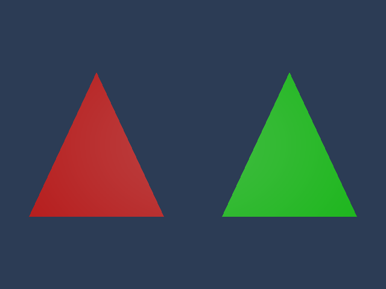
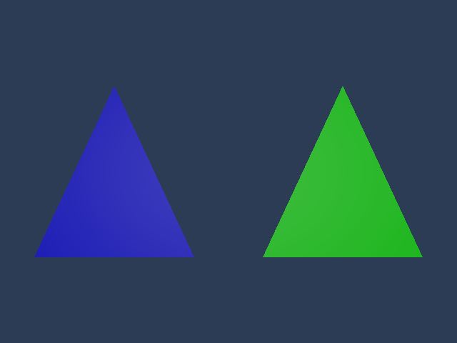

# ED-M2 scalar PBR material assets: Linux acceptance

Date: 2026-10-08. Base: `06b11369daf2f9d0da86098df5343f8e00e122cf` (main after PR #440).
The companion change implements scalar opaque Scene materials; it does not complete ED-M2.
[Exact source/capture SHA-256 values](source-hashes.json) identify the tested implementation.

## Delivered behavior

An editable schema-1 `.nmaterial` source imports to immutable typed data using its persistent UUID
sidecar. Synchronous/background reimport stages data and publishes only after live revision checks.
Source parsing is bounded to 64 KiB and workspaces/retained Content Undo to 4096 typed materials.
Canonical scalar values and their exact derived Renderer schema are validated together; unsupported
shader/profile/model/features, divergent reflected values, invalid numbers and source versions are
rejected. Failed/cancelled/stale reimports preserve the previous live payload.

A single Mesh Renderer selects a valid material asset in the docked Inspector. One generation-safe
opaque-component transaction stores the versioned UUID reference, supports Undo/Redo and survives
save/reopen. Legacy `material.shader` values, including full-width IDs, remain unchanged. Missing
assets and unsupported reference versions retain their bytes. No-op/rejected/abandoned requests
preserve Redo. Native focus loss, read-only/modal and hidden-panel transitions discard queued
requests, including blur/regain without an intervening frame. Actual dropdown clicks run at both
1x and 2x DPI; an open popup also tolerates Content becoming unavailable between frames.

Per-frame reference reads use owning bounded opaque metadata instead of copying arbitrary plugin
payloads. An oversized prefix cannot masquerade as the exact 17-byte reference. Valid Editor-owned
metadata is excluded from unavailable component inspection; unsupported metadata stays inspectable.

Scene View resolves UUIDs within the current project generation, deduplicates at most 63 authored
materials plus neutral slot zero and submits real Presentation PBR batches. Renderer-generated
valid tangents support OBJ meshes with degenerate/missing UVs and existing affine transforms.
Unresolved/over-budget references use fallback without changing stored references. With no resolved
materials, the existing Lambert preview remains active.

## Validation

Managed Linux cloud; GCC 14.2, CMake 3.31.6, Ninja `1.11.1.git.kitware.jobserver-1`,
clang-format 19.1.7 and Slang 2026.18. Xvfb runs X11 and Mesa lavapipe; Vulkan Loader identifies
`llvmpipe (LLVM 19.1.7, 256 bits)` with `libvulkan_lvp.so`. Dependencies/tools are external to the
repository. The ImGui `v1.91.9b-docking` and Vulkan-Headers `v1.3.296` sources use the existing
verified cache through `FETCHCONTENT_SOURCE_DIR_NEXORA_IMGUI` and
`FETCHCONTENT_SOURCE_DIR_NEXORA_VULKAN_HEADERS`; neither preset files nor generated output is committed.

Development configured with `NEXORA_ENABLE_EDITOR_GRAPHICAL_SHELL=ON`, `NEXORA_ENABLE_SLANG=ON`,
`CMAKE_BUILD_TYPE=Development`, `NEXORA_LINK_MODE=Modular`. Subsequent preset configuration retains
those explicit cache flags.

```bash
cmake --preset linux-development
cmake --build --preset linux-development -j 2
ctest --preset linux-development
```

**142/142 passed, zero skipped, 212.45 seconds.** The complete gate includes existing graphical,
OBJ/gizmo, recovery, mesh-reimport and the upstream atomic reflected-Inspector tests.

```bash
ctest --preset linux-development -R '^editor\.(material_(import|catalog|inspector|scene_native)|unknown_component_inspector|inspector_atomic_batch)$' --output-on-failure
```

**6/6 passed, 1.37 seconds.** Material import tests use real source files and persistent project
metadata, exercise workers and last-good publication, and test 4097 source assets against the
workspace limit. Catalog tests cover atomic rejection, contradictory/unsupported schema, project
generations, owning snapshots, large unrelated opaque data and palette overflow/deduplication.

```bash
cmake --preset linux-shipping -DFETCHCONTENT_SOURCE_DIR_NEXORA_VULKAN_HEADERS=/workspace/Nexora/build/linux-development/_deps/nexora_vulkan_headers-src
cmake --build --preset linux-shipping -j 2
```

**71 build steps passed.** This preset is Shipping/Monolithic/Minimal, with Editor, Editor SDK,
graphical shell, Slang and testing OFF. It verifies the engine build remains independent of Editor;
it does not validate shipping material consumption.

The new native gate was rerun with the Khronos layer and synchronization validation enabled:

```bash
export VK_LAYER_PATH=<external-sdk>/usr/share/vulkan/explicit_layer.d
export VK_INSTANCE_LAYERS=VK_LAYER_KHRONOS_validation
export VK_LAYER_ENABLES=VK_VALIDATION_FEATURE_ENABLE_SYNCHRONIZATION_VALIDATION_EXT
export VK_LOADER_DEBUG=layer,driver
ctest --preset linux-development -R '^editor.material_scene_native$' -V
```

**1/1 passed, 1.00 second.** Loader output attests `Inserted device layer
"VK_LAYER_KHRONOS_validation"`; native stderr contains zero `Validation Error`, `VUID-` or
`SYNC-HAZARD-` records.

## Independent native pixels

`editor.material_scene_native` imports real OBJ/material files, resolves the live mesh catalog,
assigns persisted material UUIDs, reopens the document and consumes the same production palette and
tangent helpers as Scene View. It issues real Vulkan PBR draws and checks independent X11 pixels:
left red/right green, then only left blue after material reimport. Invalid source version keeps blue;
assignment Undo and scene reopen also preserve the reimported material and legacy shader ID.
The pixel oracle checks visible dominant channels, not just descriptors or test doubles.

| Initial assignment | After left-source reimport |
| --- | --- |
|  |  |

## Scope still open

No persistent per-asset GPU geometry cache: the application still converts/uploads frame-owned
geometry. No texture/shader graph/IBL editor, multi-selection material assignment, reference removal,
Game View materials or runtime/cooked shipping material consumer. `.nmaterial` scalar source editing
is external; the Inspector assigns imported assets. Native evidence uses a virtual display and
software Vulkan device. Physical-GPU visuals, complete application visual workflows, cross-platform
host checks and full multi-DPI ED-M2 exit acceptance remain open.
